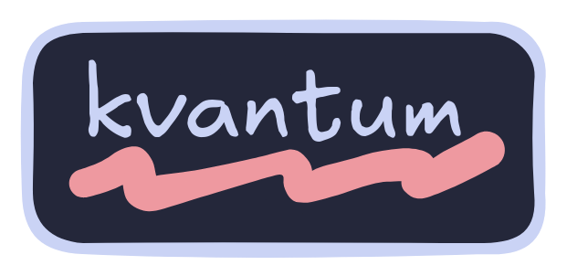

<div align="center">
<a href="#"></a>
</div>

<div align="center">

<br>

</div>

<div align="center">

<a href="#herb--about"></a>
<a href="#wrench--setup"></a>
<a href="#camera--gallery"></a>

</div>

# :herb: ‎ <samp>About</samp>

[Fish](https://fishshell.com/) is my default shell. I tried [zsh](https://zsh.org) in the past but I like the built in options of fish as well as its language and the plugin options.

Talking about plugins, these are the ones I'm currently using:

- [Catppuccin](https://github.com/catppuccin/fish)
- [Done](https://github.com/franciscolourenco/done)
- [ssh-agent](https://github.com/danhper/fish-ssh-agent)
- [fzf.fish](https://github.com/Matt-FTW/fzf.fish)
- [Abbreviations-Tips](https://github.com/gazorby/fish-abbreviation-tips)
- [Sudope](https://github.com/oh-my-fish/plugin-sudope)
- [Puffer-fish](https://github.com/nickeb96/puffer-fish)
- [Autopair](https://github.com/jorgebucaran/autopair.fish)

The prompt I use is [starship](https://starship.rs/). A minimal, easy to customize and blazingly fast prompt written in **Rust btw** 🦀

There is some completion files for apps that I use. You can check them [here](../completions/).

In term of aliases, I have none. Instead, I use custom functions, but that's just a preference. Be sure to not put your aliases inside you config.fish tho. If you wanna know more about it, check this [article](https://bsago.me/tech-notes/make-fish-start-faster).

Abbreviations are included in [this file](../abbreviations.fish).

Finally, if you want to include some custom variables to export at the start of a session, you can do so by placing theme inside [this file](../user_variables.fish). I have some variables already there to help with the XDG directory standard, fzf options, folders that need to be added into the $PATH, etc.

# :wrench: ‎ <samp>Setup</samp>

### :package: Prompt Installation

Starship can be installed from multiple sources. Make sure to check their [installation guide](https://starship.rs/guide/#%F0%9F%9A%80-installation). Once you have Starship installed, restart your session and enjoy!

### :package: Extensions Installation

To install and manage all the plugins, make sure to install [fisher](https://github.com/jorgebucaran/fisher) in your system; it is going to be our plugin manager. Here's a quick reference guide for installing, updating and removing plugins.

```bash
# To install all plugins
fisher list | fisher install

# To install a specific plugin
fisher install <name-plugin>

# To update all plugins
fisher update

# To update a specific plugin
fisher update <name-plugin>

# To remove all plugins
fisher list | fisher remove

# To remove a specific plugin
fisher remove <name-plugin>
```

### :package: Theme Installation

Once you install catppuccin the way I showed before, launch a new session and execute this command:

```bash
fish_config theme save "Catppuccin <variant-name>"
```

My variant name is **macchiato**. Close and open a new session to see the changes.

To have the LS_COLORS variable with the right colors, install [vivid](https://github.com/sharkdp/vivid) (The Arch Linux way, check docs for other installations):

```bash
sudo pacman -S vivid
```

Restart the session to see the changes.

# :camera: ‎ <samp>Gallery</samp>

| **Shell Prompt**                |
| ------------------------------- |
|  |

| **Commands and LS_COLORS**      |
| ------------------------------- |
|  |
