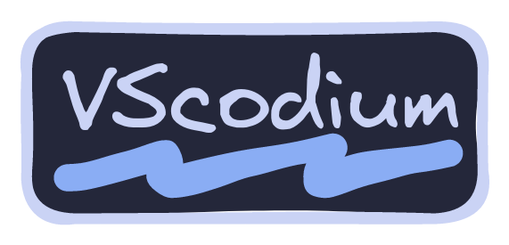
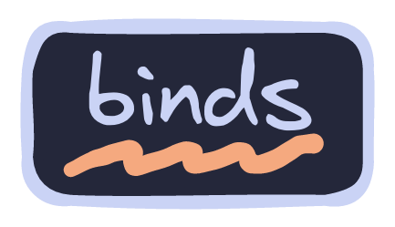

 

# :herb: ‎ <samp>About</samp>

### Plugins

- [alefragnani.project-manager](https://github.com/alefragnani/vscode-project-manager)
- [amodio.toggle-excluded-files](https://github.com/eamodio/vscode-toggle-excluded-files)
- [astro-build.astro-vscode](https://github.com/withastro/vscode-astro)
- [bmalehorn.vscode-fish](https://github.com/bmalehorn/vscode-fish)
- [bradlc.vscode-tailwindcss](https://github.com/bradlc/vscode-tailwindcss)
- [BrandonKirbyson.vscode-animations](https://github.com/BrandonKirbyson/vscode-animations)
- [Catppuccin.catppuccin-vsc](https://github.com/catppuccin/catppuccin-vscode)
- [charliermarsh.ruff](https://github.com/charliermarsh/ruff)
- [Codeium.codeium](https://github.com/VSCodeVim/vscode-vim)
- [DavidAnson.vscode-markdownlint](https://github.com/DavidAnson/vscode-markdownlint)
- [dbaeumer.vscode-eslint](https://github.com/dbaeumer/vscode-eslint)
- [drcika.apc-extension](https://github.com/drcika/apc-extension)
- [dsznajder.es7-react-js-snippets](https://github.com/dsznajder/es7-react-js-snippets)
- [eamodio.gitlens](https://github.com/eamodio/vscode-gitlens)
- [esbenp.prettier-vscode](https://github.com/esbenp/vscode-prettier)
- [ExodiusStudios.comment-anchors](https://github.com/ExodiusStudios/vscode-comment-anchors)
- [formulahendry.code-runner](https://github.com/formulahendry/vscode-code-runner)
- [golang.go](https://github.com/filipw/vscode-go)
- [humao.rest-client](https://github.com/humao/rest-client)
- [jrebocho.vscode-random](https://github.com/jrebocho/vscode-random)
- [mads-hartmann.bash-ide-vscode](https://github.com/mads-hartmann/vscode-bash-ide)
- [ms-azuretools.vscode-docker](https://github.com/microsoft/vscode-docker)
- [ms-python.python](https://github.com/microsoft/vscode-python)
- [ms-python.vscode-pylance](https://github.com/microsoft/pylance)
- [petekinnecom.terminal-command-keys](https://github.com/petekinnecom/vscode-terminal-command-keys)
- [rafamel.subtle-brackets](https://github.com/rafamel/vscode-subtle-brackets)
- [redhat.ansible](https://github.com/redhat-developer/vscode-ansible)
- [redhat.vscode-yaml](https://github.com/redhat-developer/vscode-yaml)
- [rust-lang.rust-analyzer](https://github.com/rust-lang/vscode-rust-analyzer)
- [stivo.tailwind-fold](https://github.com/stivoat/tailwind-fold)
- [streetsidesoftware.code-spell-checker](https://github.com/streetsidesoftware/vscode-spell-checker)
- [sumneko.lua](https://github.com/sumneko/vscode-lua)
- [svelte.svelte-vscode](https://github.com/sveltejs/vscode-svelte)
- [thang-nm.catppuccin-perfect-icons](https://github.com/thang-nm/catppuccin-perfect-icons)
- [timonwong.shellcheck](https://github.com/timonwong/vscode-shellcheck)
- [tobias-z.vscode-harpoon](https://github.com/tobias-z/vscode-harpoon)
- [usernamehw.errorlens](https://github.com/usernamehw/vscode-errorlens)
- [vadimcn.vscode-lldb](https://github.com/vadimcn/vscode-lldb)
- [VSpaceCode.whichkey](https://github.com/VSpaceCode/vscode-whichkey)
- [Vue.volar](https://github.com/VueVolar/vue-language-features)
- [yandeu.five-server](https://github.com/yandeu/five-server)
- [YoavBls.pretty-ts-errors](https://github.com/YoavBls/pretty-ts-errors)
- [ziglang.vscode-zig](https://github.com/ziglang/vscode-zig)

# :gear: ‎ <samp>Config</samp>

# :camera: ‎ <samp>Gallery</samp>

# :keyboard: ‎ <samp>Binds</samp>
