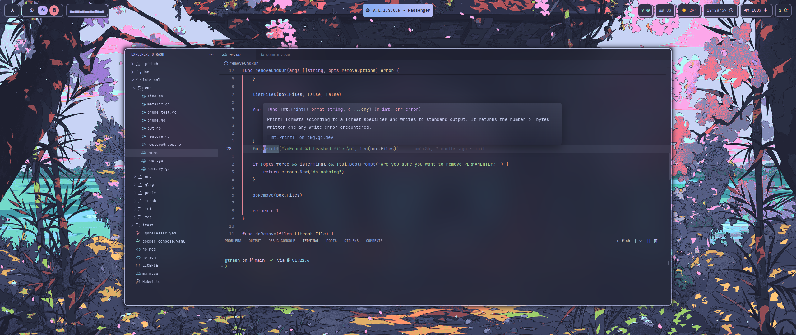
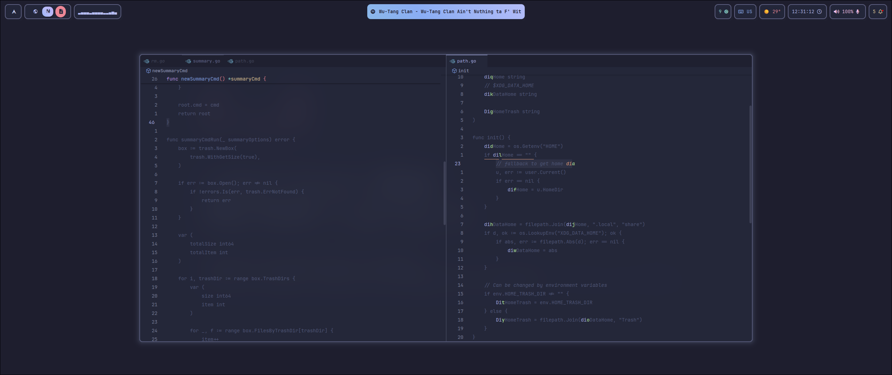
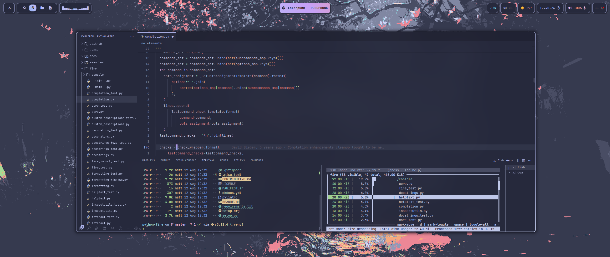

<div align="center">
<a href="#"></a>
</div>

<div align="center">

<br>

</div>

<div align="center">

<a href="#herb--about"></a>
<a href="#wrench--setup"></a>
<a href="#camera--gallery"></a>

</div>

# :herb: ‎ <samp>About</samp>

[VSCodium](https://vscodium.com/) is my fallback editor in case I cannot use neovim for some specific task, which most of the time doesn't happen but its good to have a backup option.

It's basically the binaries of [VS Code](https://code.visualstudio.com/) but without all of the Microsoft bullshit built on top of it. It functions exactly the same as VS Code, although there's some extensions such as Copilot which needs the telemetry data to function, but as I dont use it, I dont really care.

The extensions I use are the following:

- [alefragnani.project-manager](https://github.com/alefragnani/vscode-project-manager)
- [amodio.toggle-excluded-files](https://github.com/eamodio/vscode-toggle-excluded-files)
- [astro-build.astro-vscode](https://github.com/withastro/vscode-astro)
- [bmalehorn.vscode-fish](https://github.com/bmalehorn/vscode-fish)
- [bradlc.vscode-tailwindcss](https://github.com/bradlc/vscode-tailwindcss)
- [Catppuccin.catppuccin-vsc](https://github.com/catppuccin/catppuccin-vscode)
- [charliermarsh.ruff](https://github.com/charliermarsh/ruff)
- [Codeium.codeium](https://github.com/VSCodeVim/vscode-vim)
- [DavidAnson.vscode-markdownlint](https://github.com/DavidAnson/vscode-markdownlint)
- [yzhang.markdown-all-in-one](https://github.com/yzhang-gh/vscode-markdown)
- [dbaeumer.vscode-eslint](https://github.com/dbaeumer/vscode-eslint)
- [drcika.apc-extension](https://github.com/drcika/apc-extension)
- [dsznajder.es7-react-js-snippets](https://github.com/dsznajder/es7-react-js-snippets)
- [eamodio.gitlens](https://github.com/eamodio/vscode-gitlens)
- [esbenp.prettier-vscode](https://github.com/esbenp/vscode-prettier)
- [ibm.output-colorizer](https://github.com/IBM-Cloud/vscode-log-output-colorizer)
- [ExodiusStudios.comment-anchors](https://github.com/ExodiusStudios/vscode-comment-anchors)
- [formulahendry.code-runner](https://github.com/formulahendry/vscode-code-runner)
- [ms-vscode-remote.remote-ssh](https://github.com/Microsoft/vscode-remote-release)
- [golang.go](https://github.com/filipw/vscode-go)
- [humao.rest-client](https://github.com/humao/rest-client)
- [jrebocho.vscode-random](https://github.com/jrebocho/vscode-random)
- [mads-hartmann.bash-ide-vscode](https://github.com/mads-hartmann/vscode-bash-ide)
- [ms-azuretools.vscode-docker](https://github.com/microsoft/vscode-docker)
- [ms-dotnettools.csharp](https://github.com/dotnet/vscode-csharp)
- [ms-dotnettools.vscode-dotnet-runtime](https://github.com/dotnet/vscode-dotnet-runtime)
- [ms-vscode.cpptools](https://github.com/Microsoft/vscode-cpptools)
- [ms-python.python](https://github.com/microsoft/vscode-python)
- [ms-python.vscode-pylance](https://github.com/microsoft/pylance)
- [petekinnecom.terminal-command-keys](https://github.com/petekinnecom/vscode-terminal-command-keys)
- [rafamel.subtle-brackets](https://github.com/rafamel/vscode-subtle-brackets)
- [redhat.ansible](https://github.com/redhat-developer/vscode-ansible)
- [redhat.vscode-yaml](https://github.com/redhat-developer/vscode-yaml)
- [rust-lang.rust-analyzer](https://github.com/rust-lang/vscode-rust-analyzer)
- [stivo.tailwind-fold](https://github.com/stivoat/tailwind-fold)
- [streetsidesoftware.code-spell-checker](https://github.com/streetsidesoftware/vscode-spell-checker)
- [sumneko.lua](https://github.com/sumneko/vscode-lua)
- [catppuccin.catppuccin-vsc-icons](https://github.com/catppuccin/vscode-icons)
- [svelte.svelte-vscode](https://github.com/sveltejs/vscode-svelte)
- [timonwong.shellcheck](https://github.com/timonwong/vscode-shellcheck)
- [tobias-z.vscode-harpoon](https://github.com/tobias-z/vscode-harpoon)
- [usernamehw.errorlens](https://github.com/usernamehw/vscode-errorlens)
- [vadimcn.vscode-lldb](https://github.com/vadimcn/vscode-lldb)
- [VSpaceCode.whichkey](https://github.com/VSpaceCode/vscode-whichkey)
- [Vue.volar](https://github.com/VueVolar/vue-language-features)
- [yandeu.five-server](https://github.com/yandeu/five-server)
- [YoavBls.pretty-ts-errors](https://github.com/YoavBls/pretty-ts-errors)
- [ziglang.vscode-zig](https://github.com/ziglang/vscode-zig)
- [yutengjing.vscode-colorize-plus](https://github.com/tjx666/vscode-colorize)
- [barbosshack.crates-io](https://github.com/BarbossHack/crates-io)
- [pucelle.vscode-css-navigation](https://github.com/pucelle/vscode-css-navigation)
- [tamasfe.even-better-toml](https://github.com/tamasfe/taplo)
- [kisstkondoros.vscode-gutter-preview](https://github.com/kisstkondoros/gutter-preview)
- [emilast.logfilehighlighter](https://github.com/emilast/vscode-logfile-highlighter)
- [asvetliakov.vscode-neovim](https://github.com/vscode-neovim/vscode-neovim)

# :wrench: ‎ <samp>Setup</samp>

### :package: Extensions Installation

VSCodium comes with a CLI client where you can export the extensions list you have installed, or import the list of extensions you want to install.

In the repo there's a binary that can be used to install a list of extensions from a text file. [Here it is](../../../../.local/bin/installCodiumExtensions).

Firstly, here's how you can export your list of extensions:

```bash
vscodium --list-extensions > extensions.txt
```

After you have the file, here's how to install them:

```bash
~/.local/bin/installCodiumExtensions <extensions-file>
```

If you want my list, [check it out](../extensions.txt).

### :package: Native Neovim Integration

At this point, I dont think I could use VSCodium without it. Here's how you can do it:

Firstly, install the [vscode-neovim extension](https://github.com/vscode-neovim/vscode-neovim). There's the [vim extension](https://github.com/VSCodeVim/Vim) as well, but that's just an emulation meanwhile this one uses neovim under the hood and you can even load part of your configuration which is amazing.

Next up, edit the [settings.json file](../settings.json) and find the line that says `"vscode-neovim.neovimExecutablePaths.linux": "/home/matt/.local/share/bob/nvim-bin/nvim"` and change the path to your personal neovim binary.

Finally, if you want part of your neovim configuration on VSCodium, open neovim and enable the extra called `util.vscode`. After that, open VSCodium and you should be able to use some neovim plugins out of the box such as flash.nvim, and have part of the keybindings working. If you wanna enable a plugin for VSCodium you can do so by adding this options in your plugin table: `vscode = true`.

If you wanna enable some keybindings, make sure to open the vscode.lua extra file and find the autocmd where you can add new keybindings to call the VSCodium API. An example of a keybinding:

```lua
map("n", "<leader>xx", vscode_action("workbench.actions.view.problems"))
```

If you also want something like which-key, you can install the [which-key plugin](https://github.com/VSpaceCode/vscode-whichkey). Check their docs to see how to add new keybindings.

# :camera: ‎ <samp>Gallery</samp>

| **Overview**                    |
| ------------------------------- |
|  |

| **Flash.nvim inside VSCodium**  |
| ------------------------------- |
|  |

| **Multiple Terminals**          |
| ------------------------------- |
|  |
