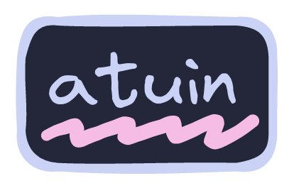
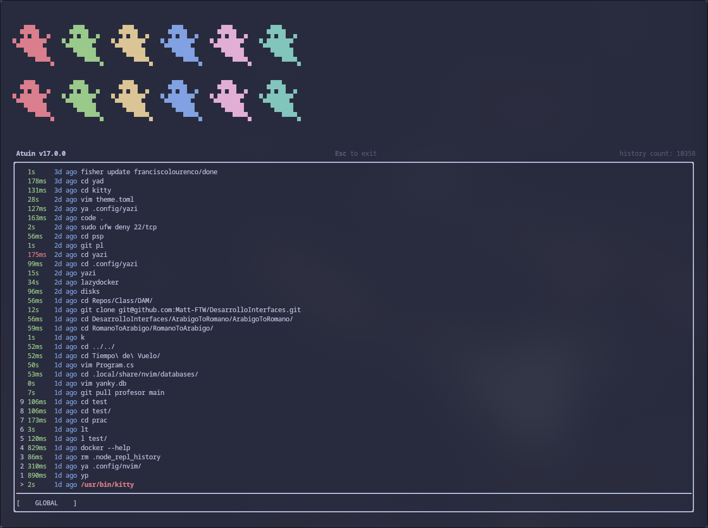
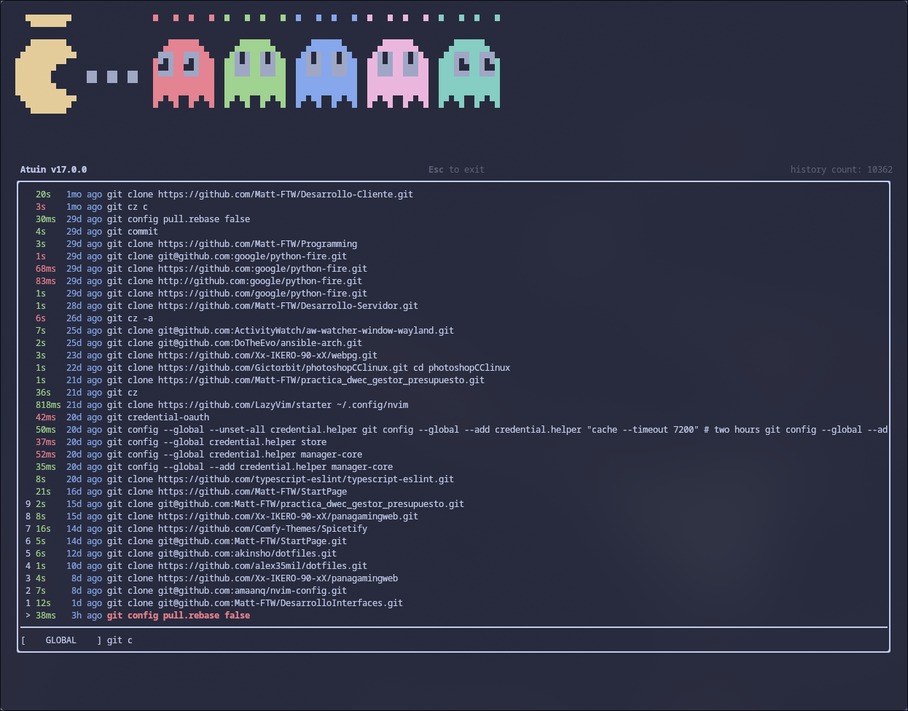

  
  
  

## :arrows_counterclockwise: <samp>[Shell History Sync](#arrows_counterclockwise-about)</samp>

Atuin is such a cool tool. It lets you easily sync all your shell history across multiple devices. I was looking for something like this for a while, and I'm glad I found it.

## :gear: <samp>[Configuration](#gear-config)</samp>

I have set Atuin to function with my shell (fish), so if you have a different shell, go over to the Fish Configuration section of the dotfiles to see how to change it.
That's only part of initializing Atuin to be able to work with your shell.

Apart from that, the configuration file can be used with all the common shells like zsh, bash, etc.

For more info on how to configure the Atuin config file, check out the **official [Atuin Configuration Guide](https://atuin.sh/docs/config/)**.

## :camera: <samp>[Gallery](#camera-gallery)</samp>

