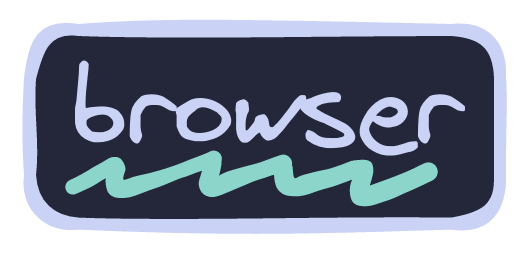
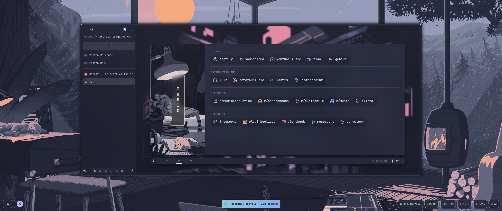
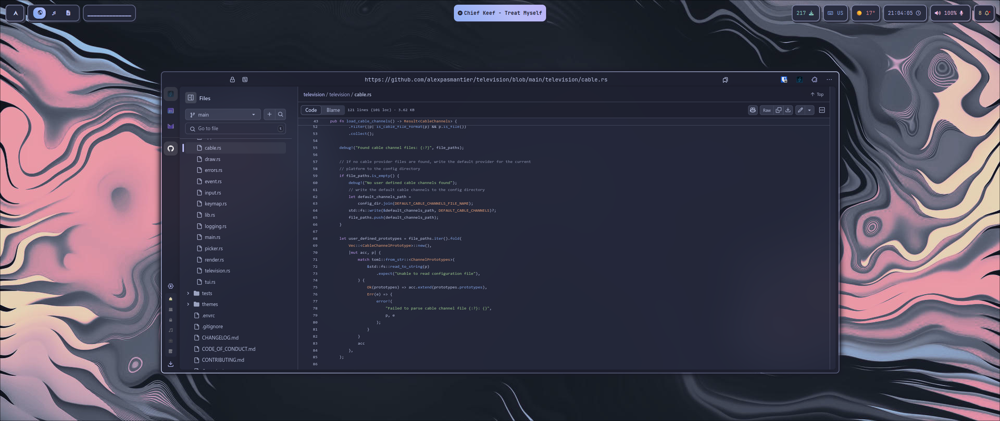

<div align="center">
<a href="#"></a>
</div>

<div align="center">

<br>

</div>

<div align="center">

<a href="#herb--about"></a>
<a href="#wrench--setup"></a>
<a href="#camera--gallery"></a>

</div>

# :herb: ‎ <samp>About</samp>

The browser I'm using right now is [Floorp](https://floorp.app). It is a fork of Firefox, which adds some functionality I really like such as:

- 🚦 Vertical Tabs
- 👉 Right Sidebar with Custom Actions
- 🔒 Strong Privacy Options and Defaults
- 🔥 Fast as F\*ck
- 🍿 And much more...

The extensions I'm using are:

- [Improve Youtube](https://github.com/code-charity/youtube) [:gear:](../extensions/improved-youtube.json)
- [Bitwarden](https://addons.mozilla.org/en-US/firefox/addon/bitwarden-password-manager/?browser=firefox)
- [Catppuccin Github Icons](https://github.com/catppuccin/github-file-explorer-icons)
- [Dark Reader](https://github.com/darkreader/darkreader) [:gear:](../extensions/dark-reader.json)
- [Firefox Color](https://addons.mozilla.org/en-US/firefox/addon/firefox-color/)
- [LibRedirect](https://github.com/libredirect/browser_extension) [:gear:](../extensions/libredirect.json)
- [New Tab Override](https://addons.mozilla.org/en-US/firefox/addon/new-tab-override/)
- [Return Youtube Dislikes](https://github.com/Anarios/return-youtube-dislike)
- [Search by Image](https://github.com/dessant/search-by-image)
- [Sidebery](https://github.com/mbnuqw/sidebery) [:gear:](../extensions/sidebery.json)
- [Sponsorblock](https://github.com/ajayyy/SponsorBlock) [:gear:](../extensions/sponsor-block.json)
- [Stylus](https://github.com/openst) [:gear:](../extensions/stylus.json)
- [SurfingKeys](https://github.com/brookhong/Surfingkeys) [:gear:](https://github.com/Matt-FTW/surfingkeys-conf)
- [Tab Session Manager](https://github.com/sienori/Tab-Session-Manager) [:gear:](../extensions/session-manager.json)
- [uBlock Origin](https://github.com/gorhill/uBlock#ublock-origin) [:gear:](../extensions/ublock.txt)
- [Web Scrobbler](https://github.com/web-scrobbler/web-scrobbler)
- [ViolentMonkey](https://github.com/violentmonkey/violentmonkey) [:gear:](../extensions/violentmonkey.zip)
  Scripts:
  - [Simple YouTube Age Restriction Bypass](https://greasyfork.org/en/scripts/423851-simple-youtube-age-restriction-bypass)
  - [KeepChatGPT](https://greasyfork.org/en/scripts/462804-keepchatgpt)
  - [YouTube - Stay Active and Play Forever](https://greasyfork.org/en/scripts/390352-youtube-stay-active-and-play-forever)
  - [Bypass All Shortlinks Debloated](https://codeberg.org/Amm0ni4/bypass-all-shortlinks-debloated)
  - [GreasyFork Bullshit Filter](https://greasyfork.org/en/scripts/12179-greasyfork-bull-filter)
  - [Fandom Redirect](https://greasyfork.org/en/scripts/476527-fandom-redirect)

I'm also using my [custom Startpage](https://github.com/Matt-FTW/startpage) based on [this project](https://github.com/pivoshenko/catppuccin-startpage).

# :wrench: ‎ <samp>Setup</samp>

> [!WARNING]
> Guide is created only for Firefox based browsers.

### :package: Theme Installation

First of all, check your active profile. To do so, type `about:profiles` in your browser toolbar. Open the folder where that profile is located (~/.{browser}/{profileid}/). Now symlink or copy the chrome folder from the configuration to the active profile folder.

**Be sure to change the path to your profile**.

```bash
# Symlink the folder (Recommended)
ln -s ~/.config/browser/chrome/ ~/.{browser}/{profileid}/chrome

# Copy the folder
cp -r ~/.config/browser/chrome/ ~/.{browser}/{profileid}/chrome
```

Now, to install the colorscheme for your browser make sure to follow [this guide](https://github.com/catppuccin/firefox) and select the **Macchiato** variant and the **Lavender** accent color.

Close all instances of your browser and open it again.

Tada! 🎉 You should now see your theme correctly installed.

### :package: user.js Installation

Just like before, check your active profile. Now copy the user.js file from the configuration to the active profile folder.

```bash
cp ~/.config/browser/user.js ~/.{browser}/{profileid}/user.js
```

As before, close all instances of your browser and you should be able to test your new user.js.

### :package: Extensions Installation

Read the extensions list over on [this file](). To import the configurations, check each extensions docs to see how.

### :package: Startpage Installation

Read the Startpage [usage section](https://github.com/Matt-FTW/startpage?tab=readme-ov-file#usage) in the README.

# :camera: ‎ <samp>Gallery</samp>

| **Startpage**                   |
| ------------------------------- |
|  |

| **Github Repo**                 |
| ------------------------------- |
|  |

</div>
