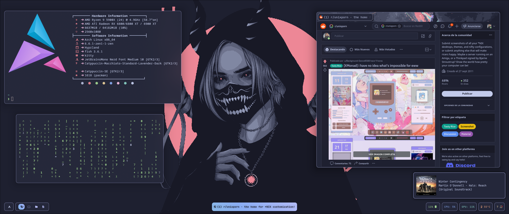

<div align="center">
<a href="#"></a>
</div>

<div align="center">

<br>

</div>

<div align="center">

<a href="#herb--about"></a>
<a href="#wrench--setup"></a>
<a href="#camera--gallery"></a>

</div>

# :herb: ‎ <samp>About</samp>

[Hyprland](https://hyprland.org/) is my default window manager. It has stunning animations (which I always wanted when I started using a WM), excellent Wayland support, dynamic tiling which I prefer over manual or hybrid and an amazing ecosystem of plugins and applications.

The plugins I'm using are the following:

- [Hyprsplit](https://github.com/shezdy/hyprsplit)
- [Hyprexpo](https://github.com/hyprwm/hyprland-plugins/tree/main/hyprexpo)
- [Hyprspace](https://github.com/KZDKM/Hyprspace) (_Disabled_)
- [Dynamic Cursors](https://github.com/VirtCode/hypr-dynamic-cursors) (_Disabled_)
- [Hyprtrails](https://github.com/hyprwm/hyprland-plugins/tree/main/hyprtrails) (_Disabled_)

Alongside this plugins, I use some specific apps from the hypr ecosystem

- [Hyprlock](https://github.com/hyprwm/hyprlock)
- [Hypridle](https://github.com/hyprwm/hypridle)
- [Hyprpicker](https://github.com/hyprwm/hyprpicker)
- [pyprland](https://github.com/hyprland-community/pyprland)
- [Hyprshot](https://github.com/Gustash/Hyprshot) (_Script_)
- [Hyprfreeze](https://github.com/Zerodya/hyprfreeze) (_Script_)

Focusing in the config, hyprland.conf imports every config file, from the binds to the inputs, monitors or the theme.

If you want to easily configure the workspaces or the monitors, check out [this program](https://github.com/nwg-piotr/nwg-displays).

Wanna see or add new bindings? Check [this file](../configs/binds.conf).

Wanna edit the theme? Check [this folder](../theme/).

Are you interested in all of the more than 100 wallpapers available? [Check them out!](../theme/walls/.github/README.md)

Maybe you want to add a new app or service to autostart? Check [this](../scripts/autostart/)

If you want to add a new script to the config, go to [this folder](../scripts/).

If you have any other default programs, you can edit [this file](../configs/default_apps.conf) to set your defaults.

# :wrench: ‎ <samp>Setup</samp>

### :package: Extensions Installation

You can manage and install extensions with `hyprpm`, a package manager that ships by default with hyprland. Here's a quick reference guide for installing, updating and removing extensions.

> [!WARNING]
> hyprpm update may not work. This is and issue with hyprland and its plugins, not with the dotfiles themselves.

```bash
# Installing an extension
hyprpm add <repo-link>

# To update all extensions
hyprpm update

# To remove an specific extension
hyprpm remove <extension-name>
```

After you install an extension, make sure to enable it:

```bash
hyprpm enable <extensions-name>
```

# :camera: ‎ <samp>Gallery</samp>

| **Overview 1**                  |
| ------------------------------- |
|  |

| **Overview 2**                  |
| ------------------------------- |
|  |

| **Overview 3**                  |
| ------------------------------- |
|  |
