

 

# :herb: ‎ <samp>About</samp>

[Neovim](https://neovim.io/) is my main editor of choice. Not only is faster than its competitors, but it's also super customizable, obviously uses the vim bindings (which are the best thing when it comes to manipulating text) and has a great and big community. This are the tip of the iceberg, but since I made the change back in 2023, I never looked back.

I first started using vanilla Neovim without any configurations and trying to build my own config from scratch, but I got a little frustrated and decided to try some preconfigured configs. After a lot of trying and researching I stumbled upon [LazyVim](https://github.com/LazyVim/LazyVim), which is the one I'm currently using as a base. It has the best defaults by far, easy to get into and customize, active maintainer (i love you Folke 💕), and finally the best feature: extras.

Extras are basically a bunch of plugin specs, which you can divide in different files. You can import each other as well, and they serve as plugins that you can enable and disable easily through a menu by typing the `:LazyExtras` command. This is so good when you are trying to built a configuration that depending on the project or the tastes of the person, can select different plugin selections.

This is what I built my configuration around. You can built on top of LazyVim with the extras you want to enable or disable. It makes for hundreds of plugin combinations and is all super modular. Currently, there are more than 200 extras available to choose. Do you want to know which plugins/extras I have? You can check them [over here](https://dotfyle.com/Matt-FTW/dotfiles-config-nvim).

There are a lot of languages supported (zig, rust, svelte, typescript, java, go, etc), as well as a bunch of formatters (biome, prettier, ruff, stylua, shfmt, rustywind, etc) and linters (biome, eslint, pylint, selene, markdownlint, stylelint, etc).

All the other configuration that you want to do, like assigning some new keymaps, options or autocmds, can be done like in LazyVim, and all the defaults and configuration options are the ones from LazyVim, so if you tried it before, you're gonna like this 😉. Check the [LazyVim docs](https://www.lazyvim.org/) to know more about it.

# :wrench: ‎ <samp>Setup</samp>

### :package: Extras Installation

To install an extra is just as easy as opening neovim, typing `:Lazyextras`, and selecting any row from the menu that appears. To select one, hit the `x` key. And your done, be sure to close and open again neovim to see the changes.

If you see any errors with a custom extra, be sure to report it by creating a [new issue](https://github.com/Matt-FTW/dotfiles/issues/new/choose).

# :camera: ‎ <samp>Gallery</samp>

| **Dashboard**                        |
| ------------------------------------ |
| 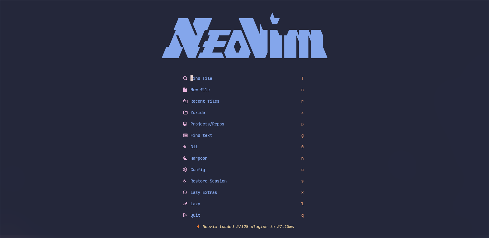 |

| **Telescope Find-files**               |
| -------------------------------------- |
|  |

| **Neo-tree**                       | **Symbols Outline**              |
| ---------------------------------- | -------------------------------- |
| 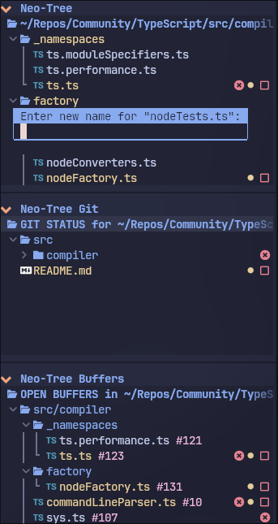 | 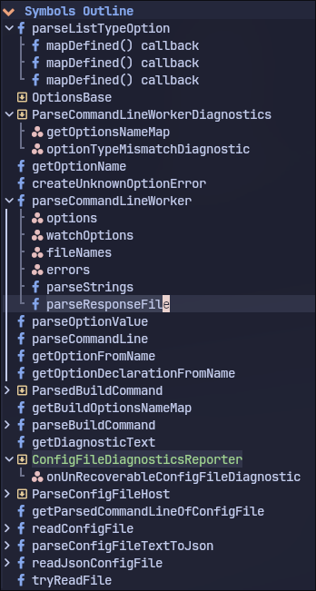 |

| **Bufferline**                         |
| -------------------------------------- |
| 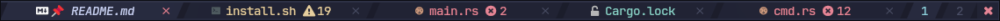 |

| **Lualine**                      |
| -------------------------------- |
|  |

| **Notify Info**                   | **Notify Warning**                      | **Notify Error**                    |
| --------------------------------- | --------------------------------------- | ----------------------------------- |
|  | 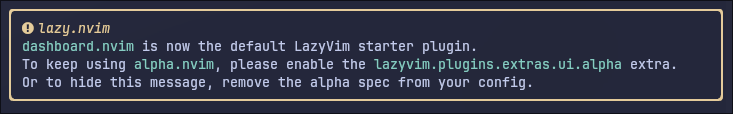 | 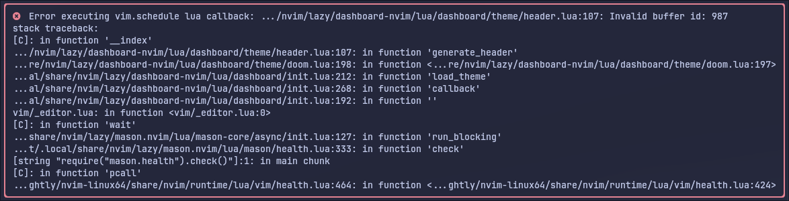 |

| **Which-key**                        |
| ------------------------------------ |
|  |

| **Telescope Live-Grep**              |
| ------------------------------------ |
|  |

| **Cmp**                      |
| ---------------------------- |
| 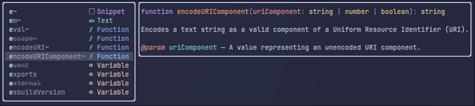     |
| 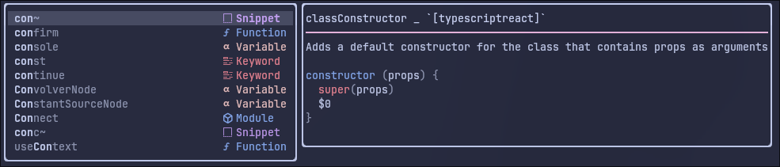 |

| **Breadcrumbs**                          |
| ---------------------------------------- |
| 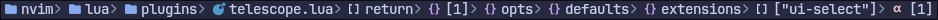 |

| **Actions Preview**                              |
| ------------------------------------------------ |
|  |

| **Trouble**                      |
| -------------------------------- |
| 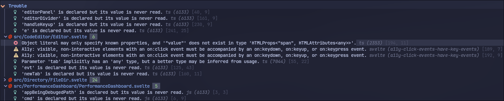 |

| **Diff-History**                           |
| ------------------------------------------ |
| 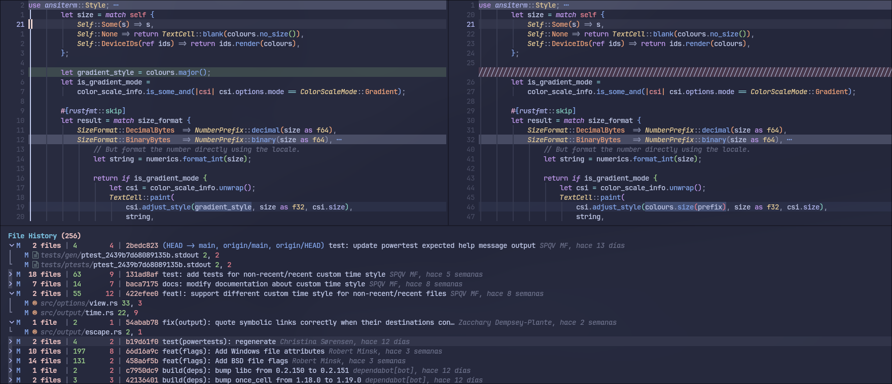 |

| **Floaterm**                             |
| ---------------------------------------- |
| 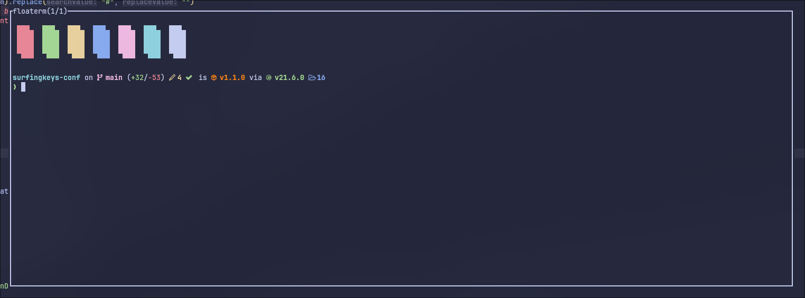 |

| **Dressing Menu**                  |
| ---------------------------------- |
| 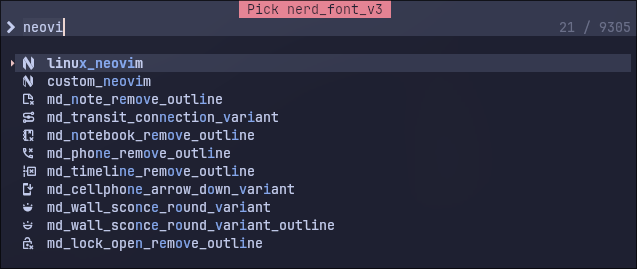 |
