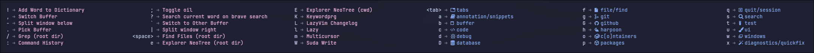

 

# :herb: ‎ <samp>About</samp>

<!--toc:start-->

- [Plugins](#plugins)
- [Programming Language/Technology Support](#programming-languagetechnology-support)
- [Language Servers](#language-servers)
- [Linters](#linters)
- [Formatters](#formatters)

<!--toc:end-->

### Plugins

<b>🤖 AI</b>

- [Exafunction/codeium.nvim](https://dotfyle.com/plugins/Exafunction/codeium.nvim)
- [tzachar/cmp-tabnine](https://github.com/tzachar/cmp-tabnine)
- [jackMort/ChatGPT.nvim](https://dotfyle.com/plugins/jackMort/ChatGPT.nvim)
- [zbirenbaum/copilot.lua](https://dotfyle.com/plugins/zbirenbaum/copilot.lua)
- [David-Kunz/gen.nvim](https://dotfyle.com/plugins/David-Kunz/gen.nvim)

<b>📊 Bars and lines</b>

- [utilyre/barbecue.nvim](https://dotfyle.com/plugins/utilyre/barbecue.nvim)
- [SmiteshP/nvim-navic](https://dotfyle.com/plugins/SmiteshP/nvim-navic)
- [Bekaboo/dropbar.nvim](https://dotfyle.com/plugins/Bekaboo/dropbar.nvim)
- [luukvbaal/statuscol.nvim](https://dotfyle.com/plugins/luukvbaal/statuscol.nvim)

<b>🏃 Code runner</b>

- [stevearc/overseer.nvim](https://dotfyle.com/plugins/stevearc/overseer.nvim)
- [michaelb/sniprun](https://dotfyle.com/plugins/michaelb/sniprun)
- [Civitasv/cmake-tools.nvim](https://dotfyle.com/plugins/Civitasv/cmake-tools.nvim)
- [Zeioth/compiler.nvim](https://dotfyle.com/plugins/Zeioth/compiler.nvim)

<b>🖌️ Color</b>

- [folke/twilight.nvim](https://dotfyle.com/plugins/folke/twilight.nvim)
- [mvllow/modes.nvim](https://dotfyle.com/plugins/mvllow/modes.nvim)
- [echasnovski/mini.hipatterns](https://dotfyle.com/plugins/echasnovski/mini.hipatterns)
- [miversen33/sunglasses.nvim](https://dotfyle.com/plugins/miversen33/sunglasses.nvim)
- [xiyaowong/nvim-transparent](https://dotfyle.com/plugins/xiyaowong/nvim-transparent)
- [uga-rosa/ccc.nvim](https://dotfyle.com/plugins/uga-rosa/ccc.nvim)

<b>🎨 Colorscheme</b>

- [rockerBOO/boo-colorscheme-nvim](https://dotfyle.com/plugins/rockerBOO/boo-colorscheme-nvim)
- [samharju/synthweave.nvim](https://dotfyle.com/plugins/samharju/synthweave.nvim)
- [HoNamDuong/hybrid.nvim](https://dotfyle.com/plugins/HoNamDuong/hybrid.nvim)
- [craftzdog/solarized-osaka.nvim](https://dotfyle.com/plugins/craftzdog/solarized-osaka.nvim)
- [shaunsingh/moonlight.nvim](https://dotfyle.com/plugins/shaunsingh/moonlight.nvim)
- [savq/melange-nvim](https://dotfyle.com/plugins/savq/melange-nvim)
- [projekt0n/github-nvim-theme](https://dotfyle.com/plugins/projekt0n/github-nvim-theme)
- [marko-cerovac/material.nvim](https://dotfyle.com/plugins/marko-cerovac/material.nvim)
- [mhartington/oceanic-next](https://dotfyle.com/plugins/mhartington/oceanic-next)
- [sainnhe/gruvbox-material](https://dotfyle.com/plugins/sainnhe/gruvbox-material)
- [ribru17/bamboo.nvim](https://dotfyle.com/plugins/ribru17/bamboo.nvim)
- [shaunsingh/nord.nvim](https://dotfyle.com/plugins/shaunsingh/nord.nvim)
- [kaiuri/nvim-juliana](https://dotfyle.com/plugins/kaiuri/nvim-juliana)
- [Tsuzat/NeoSolarized.nvim](https://dotfyle.com/plugins/Tsuzat/NeoSolarized.nvim)
- [nyngwang/nvimgelion](https://dotfyle.com/plugins/nyngwang/nvimgelion)
- [sainnhe/everforest](https://dotfyle.com/plugins/sainnhe/everforest)
- [miikanissi/modus-themes.nvim](https://dotfyle.com/plugins/miikanissi/modus-themes.nvim)
- [sainnhe/edge](https://dotfyle.com/plugins/sainnhe/edge)
- [folke/tokyonight.nvim](https://dotfyle.com/plugins/folke/tokyonight.nvim)
- [ellisonleao/gruvbox.nvim](https://dotfyle.com/plugins/ellisonleao/gruvbox.nvim)
- [echasnovski/mini.base16](https://dotfyle.com/plugins/echasnovski/mini.base16)
- [xero/miasma.nvim](https://dotfyle.com/plugins/xero/miasma.nvim)
- [scottmckendry/cyberdream.nvim](https://dotfyle.com/plugins/scottmckendry/cyberdream.nvim)
- [NTBBloodbath/doom-one.nvim](https://dotfyle.com/plugins/NTBBloodbath/doom-one.nvim)
- [catppuccin/nvim](https://dotfyle.com/plugins/catppuccin/nvim)
- [nyoom-engineering/oxocarbon.nvim](https://dotfyle.com/plugins/nyoom-engineering/oxocarbon.nvim)
- [lewpoly/sherbet.nvim](https://dotfyle.com/plugins/lewpoly/sherbet.nvim)
- [olimorris/onedarkpro.nvim](https://dotfyle.com/plugins/olimorris/onedarkpro.nvim)
- [sainnhe/sonokai](https://dotfyle.com/plugins/sainnhe/sonokai)
- [rebelot/kanagawa.nvim](https://dotfyle.com/plugins/rebelot/kanagawa.nvim)
- [rose-pine/neovim](https://dotfyle.com/plugins/rose-pine/neovim)
- [mcchrish/zenbones.nvim](https://dotfyle.com/plugins/mcchrish/zenbones.nvim)
- [navarasu/onedark.nvim](https://dotfyle.com/plugins/navarasu/onedark.nvim)
- [Mofiqul/dracula.nvim](https://dotfyle.com/plugins/Mofiqul/dracula.nvim)
- [AlexvZyl/nordic.nvim](https://dotfyle.com/plugins/AlexvZyl/nordic.nvim)
- [olivercederborg/poimandres.nvim](https://dotfyle.com/plugins/olivercederborg/poimandres.nvim)
- [bluz71/vim-nightfly-colors](https://dotfyle.com/plugins/bluz71/vim-nightfly-colors)
- [ramojus/mellifluous.nvim](https://dotfyle.com/plugins/ramojus/mellifluous.nvim)
- [EdenEast/nightfox.nvim](https://dotfyle.com/plugins/EdenEast/nightfox.nvim)
- [kvrohit/rasmus.nvim](https://dotfyle.com/plugins/kvrohit/rasmus.nvim)
- [rmehri01/onenord.nvim](https://dotfyle.com/plugins/rmehri01/onenord.nvim)
- [titanzero/zephyrium](https://dotfyle.com/plugins/titanzero/zephyrium)
- [Mofiqul/vscode.nvim](https://dotfyle.com/plugins/Mofiqul/vscode.nvim)
- [bluz71/vim-moonfly-colors](https://dotfyle.com/plugins/bluz71/vim-moonfly-colors)

<b>💬 Comment</b>

- [LudoPinelli/comment-box.nvim](https://dotfyle.com/plugins/LudoPinelli/comment-box.nvim)
- [Zeioth/dooku.nvim](https://dotfyle.com/plugins/Zeioth/dooku.nvim)
- [danymat/neogen](https://dotfyle.com/plugins/danymat/neogen)
- [echasnovski/mini.comment](https://dotfyle.com/plugins/echasnovski/mini.comment)
- [JoosepAlviste/nvim-ts-context-commentstring](https://dotfyle.com/plugins/JoosepAlviste/nvim-ts-context-commentstring)
- [folke/todo-comments.nvim](https://dotfyle.com/plugins/folke/todo-comments.nvim)

<b>🔥 Completion</b>

- [hrsh7th/nvim-cmp](https://dotfyle.com/plugins/hrsh7th/nvim-cmp)
- [hrsh7th/cmp-buffer](https://github.com/hrsh7th/cmp-buffer)
- [hrsh7th/cmp-nvim-lsp](https://github.com/hrsh7th/cmp-nvim-lsp)
- [hrsh7th/cmp-path](https://github.com/hrsh7th/cmp-path)
- [saadparwaiz1/cmp_luasnip](https://github.com/saadparwaiz1/cmp_luasnip)
- [lukas-reineke/cmp-rg](https://dotfyle.com/plugins/lukas-reineke/cmp-rg)
- [lukas-reineke/cmp-under-comparator](https://dotfyle.com/plugins/lukas-reineke/cmp-under-comparator)
- [petertriho/cmp-git](https://github.com/petertriho/cmp-git)
- [amarakon/nvim-cmp-fonts](https://github.com/amarakon/nvim-cmp-fonts)
- [hrsh7th/cmp-emoji](https://github.com/hrsh7th/cmp-emoji)
- [chrisgrieser/cmp_yanky](https://github.com/chrisgrieser/cmp_yanky)
- [chrisgrieser/cmp-nerdfont](https://github.com/chrisgrieser/cmp-nerdfont)
- [SergioRibera/cmp-dotenv](https://github.com/SergioRibera/cmp-dotenv)
- [roobert/tailwindcss-colorizer-cmp.nvim](https://dotfyle.com/plugins/roobert/tailwindcss-colorizer-cmp.nvim)

<b>〰️ Cursorline</b>

- [mawkler/modicator.nvim](https://dotfyle.com/plugins/mawkler/modicator.nvim)
- [RRethy/vim-illuminate](https://dotfyle.com/plugins/RRethy/vim-illuminate)

<b>🦠 Debugging</b>

- [Weissle/persistent-breakpoints.nvim](https://dotfyle.com/plugins/Weissle/persistent-breakpoints.nvim)
- [mfussenegger/nvim-dap](https://dotfyle.com/plugins/mfussenegger/nvim-dap)
- [andrewferrier/debugprint.nvim](https://dotfyle.com/plugins/andrewferrier/debugprint.nvim)

<b>📦 Dependency management</b>

- [Saecki/crates.nvim](https://dotfyle.com/plugins/Saecki/crates.nvim)
- [williamboman/mason.nvim](https://dotfyle.com/plugins/williamboman/mason.nvim)
- [piersolenski/telescope-import.nvim](https://dotfyle.com/plugins/piersolenski/telescope-import.nvim)
- [vuki656/package-info.nvim](https://dotfyle.com/plugins/vuki656/package-info.nvim)

<b>🔬 Diagnostics</b>

- [folke/trouble.nvim](https://dotfyle.com/plugins/folke/trouble.nvim)
- [artemave/workspace-diagnostics.nvim](https://dotfyle.com/plugins/artemave/workspace-diagnostics.nvim)

<b>📝 Editing support</b>

- [monaqa/dial.nvim](https://dotfyle.com/plugins/monaqa/dial.nvim)
- [chrisgrieser/nvim-various-textobjs](https://dotfyle.com/plugins/chrisgrieser/nvim-various-textobjs)
- [johmsalas/text-case.nvim](https://dotfyle.com/plugins/johmsalas/text-case.nvim)
- [ckolkey/ts-node-action](https://dotfyle.com/plugins/ckolkey/ts-node-action)
- [debugloop/telescope-undo.nvim](https://dotfyle.com/plugins/debugloop/telescope-undo.nvim)
- [echasnovski/mini.pairs](https://dotfyle.com/plugins/echasnovski/mini.pairs)
- [smoka7/multicursors.nvim](https://github.com/smoka7/multicursors.nvim)
- [nvim-treesitter/nvim-treesitter-context](https://dotfyle.com/plugins/nvim-treesitter/nvim-treesitter-context)
- [folke/zen-mode.nvim](https://dotfyle.com/plugins/folke/zen-mode.nvim)
- [shortcuts/no-neck-pain.nvim](https://dotfyle.com/plugins/shortcuts/no-neck-pain.nvim)
- [HiPhish/rainbow-delimiters.nvim](https://dotfyle.com/plugins/HiPhish/rainbow-delimiters.nvim)
- [windwp/nvim-autopairs](https://dotfyle.com/plugins/windwp/nvim-autopairs)
- [Wansmer/sibling-swap.nvim](https://dotfyle.com/plugins/Wansmer/sibling-swap.nvim)
- [altermo/ultimate-autopair.nvim](https://dotfyle.com/plugins/altermo/ultimate-autopair.nvim)
- [haringsrob/nvim_context_vt](https://dotfyle.com/plugins/haringsrob/nvim_context_vt)
- [nacro90/numb.nvim](https://dotfyle.com/plugins/nacro90/numb.nvim)
- [windwp/nvim-ts-autotag](https://dotfyle.com/plugins/windwp/nvim-ts-autotag)
- [gbprod/yanky.nvim](https://dotfyle.com/plugins/gbprod/yanky.nvim)
- [bennypowers/nvim-regexplainer](https://dotfyle.com/plugins/bennypowers/nvim-regexplainer)
- [echasnovski/mini.ai](https://dotfyle.com/plugins/echasnovski/mini.ai)
- [cshuaimin/ssr.nvim](https://dotfyle.com/plugins/cshuaimin/ssr.nvim)
- [chrisgrieser/nvim-puppeteer](https://dotfyle.com/plugins/chrisgrieser/nvim-puppeteer)

<b>📁 File explorer</b>

- [nvim-neo-tree/neo-tree.nvim](https://dotfyle.com/plugins/nvim-neo-tree/neo-tree.nvim)
- [echasnovski/mini.files](https://dotfyle.com/plugins/echasnovski/mini.files)
- [stevearc/oil.nvim](https://dotfyle.com/plugins/stevearc/oil.nvim)

<b>🔠 Formatting</b>

- [echasnovski/mini.align](https://dotfyle.com/plugins/echasnovski/mini.align)
- [stevearc/conform.nvim](https://dotfyle.com/plugins/stevearc/conform.nvim)

<b>🔎 Search</b>

- [jvgrootveld/telescope-zoxide](https://dotfyle.com/plugins/jvgrootveld/telescope-zoxide)
- [nvim-telescope/telescope.nvim](https://dotfyle.com/plugins/nvim-telescope/telescope.nvim)

<b>🎮 Game</b>

- [ThePrimeagen/vim-be-good](https://dotfyle.com/plugins/ThePrimeagen/vim-be-good)
- [NStefan002/speedtyper.nvim](https://dotfyle.com/plugins/NStefan002/speedtyper.nvim)

<b>🔨 Git</b>

- [lewis6991/gitsigns.nvim](https://dotfyle.com/plugins/lewis6991/gitsigns.nvim)
- [akinsho/git-conflict.nvim](https://dotfyle.com/plugins/akinsho/git-conflict.nvim)
- [sindrets/diffview.nvim](https://dotfyle.com/plugins/sindrets/diffview.nvim)
- [NeogitOrg/neogit](https://dotfyle.com/plugins/NeogitOrg/neogit)

<b>🐙 Github</b>

- [pwntester/octo.nvim](https://dotfyle.com/plugins/pwntester/octo.nvim)

<b>🔴 Icon</b>

- [ziontee113/icon-picker.nvim](https://dotfyle.com/plugins/ziontee113/icon-picker.nvim)

  
<b>👉 Indent</b>

- [echasnovski/mini.indentscope](https://dotfyle.com/plugins/echasnovski/mini.indentscope)
- [lukas-reineke/indent-blankline.nvim](https://dotfyle.com/plugins/lukas-reineke/indent-blankline.nvim)

<b>⌨️ Keybinding</b>

- [max397574/better-escape.nvim](https://dotfyle.com/plugins/max397574/better-escape.nvim)
- [folke/which-key.nvim](https://dotfyle.com/plugins/folke/which-key.nvim)
- [tris203/hawtkeys.nvim](https://dotfyle.com/plugins/tris203/hawtkeys.nvim)

<b>📜 LSP</b>

- [simrat39/symbols-outline.nvim](https://dotfyle.com/plugins/simrat39/symbols-outline.nvim)
- [antosha417/nvim-lsp-file-operations](https://github.com/antosha417/nvim-lsp-file-operations)
- [Wansmer/symbol-usage.nvim](https://dotfyle.com/plugins/Wansmer/symbol-usage.nvim)
- [aznhe21/actions-preview.nvim](https://dotfyle.com/plugins/aznhe21/actions-preview.nvim)
- [smjonas/inc-rename.nvim](https://dotfyle.com/plugins/smjonas/inc-rename.nvim)
- [ThePrimeagen/refactoring.nvim](https://github.com/ThePrimeagen/refactoring.nvim)
- [MaximilianLloyd/tw-values.nvim](https://dotfyle.com/plugins/MaximilianLloyd/tw-values.nvim)
- [nvimtools/none-ls.nvim](https://dotfyle.com/plugins/nvimtools/none-ls.nvim)
- [neovim/nvim-lspconfig](https://dotfyle.com/plugins/neovim/nvim-lspconfig)
- [mfussenegger/nvim-lint](https://dotfyle.com/plugins/mfussenegger/nvim-lint)
- [VidocqH/lsp-lens.nvim](https://dotfyle.com/plugins/VidocqH/lsp-lens.nvim)
- [hedyhli/outline.nvim](https://dotfyle.com/plugins/hedyhli/outline.nvim)
- [kosayoda/nvim-lightbulb](https://dotfyle.com/plugins/kosayoda/nvim-lightbulb)
- [b0o/SchemaStore.nvim](https://dotfyle.com/plugins/b0o/SchemaStore.nvim)
- [mrcjkb/haskell-tools.nvim](https://dotfyle.com/plugins/mrcjkb/haskell-tools.nvim)
- [stevearc/aerial.nvim](https://dotfyle.com/plugins/stevearc/aerial.nvim)

<b>📄 Markdown</b>

- [Zeioth/markmap.nvim](https://dotfyle.com/plugins/Zeioth/markmap.nvim)
- [iamcco/markdown-preview.nvim](https://dotfyle.com/plugins/iamcco/markdown-preview.nvim)
- [toppair/peek.nvim](https://dotfyle.com/plugins/toppair/peek.nvim)
- [lukas-reineke/headlines.nvim](https://dotfyle.com/plugins/lukas-reineke/headlines.nvim)

<b>🔖 Marks</b>

- [ThePrimeagen/harpoon](https://dotfyle.com/plugins/ThePrimeagen/harpoon)
- [tomasky/bookmarks.nvim](https://dotfyle.com/plugins/tomasky/bookmarks.nvim)

<b>📸 Media</b>

- [andweeb/presence.nvim](https://dotfyle.com/plugins/andweeb/presence.nvim)
- [edluffy/hologram.nvim](https://dotfyle.com/plugins/edluffy/hologram.nvim)
- [ellisonleao/carbon-now.nvim](https://dotfyle.com/plugins/ellisonleao/carbon-now.nvim)

<b>🚶 Motion</b>

- [folke/flash.nvim](https://dotfyle.com/plugins/folke/flash.nvim)
- [edluffy/specs.nvim](https://dotfyle.com/plugins/edluffy/specs.nvim)
- [chrisgrieser/nvim-spider](https://dotfyle.com/plugins/chrisgrieser/nvim-spider)
- [ggandor/leap.nvim](https://dotfyle.com/plugins/ggandor/leap.nvim)
- [ggandor/flit.nvim](https://dotfyle.com/plugins/ggandor/flit.nvim)
- [ggandor/leap-spooky.nvim](https://dotfyle.com/plugins/ggandor/leap-spooky.nvim)

<b>📚 Note-Taking</b>

- [nvim-neorg/neorg](https://dotfyle.com/plugins/nvim-neorg/neorg)
- [epwalsh/obsidian.nvim](https://dotfyle.com/plugins/epwalsh/obsidian.nvim)

<b>🔧 Nvim Development</b>

- [anuvyklack/animation.nvim](https://dotfyle.com/plugins/anuvyklack/animation.nvim)
- [jbyuki/one-small-step-for-vimkind](https://dotfyle.com/plugins/jbyuki/one-small-step-for-vimkind)
- [ray-x/guihua.lua](https://dotfyle.com/plugins/ray-x/guihua.lua)
- [kkharji/sqlite.lua](https://dotfyle.com/plugins/kkharji/sqlite.lua)
- [folke/neodev.nvim](https://dotfyle.com/plugins/folke/neodev.nvim)
- [MunifTanjim/nui.nvim](https://dotfyle.com/plugins/MunifTanjim/nui.nvim)
- [nvim-lua/plenary.nvim](https://dotfyle.com/plugins/nvim-lua/plenary.nvim)

<b>🔡 Programming Language Support</b>

- [gennaro-tedesco/nvim-jqx](https://dotfyle.com/plugins/gennaro-tedesco/nvim-jqx)
- [mrcjkb/rustaceanvim](https://dotfyle.com/plugins/mrcjkb/rustaceanvim)
- [dmmulroy/tsc.nvim](https://dotfyle.com/plugins/dmmulroy/tsc.nvim)
- [mfussenegger/nvim-jdtls](https://dotfyle.com/plugins/mfussenegger/nvim-jdtls)
- [ray-x/go.nvim](https://dotfyle.com/plugins/ray-x/go.nvim)

<b>📂 Project</b>

- [ahmedkhalf/project.nvim](https://dotfyle.com/plugins/ahmedkhalf/project.nvim)
- [natecraddock/workspaces.nvim](https://dotfyle.com/plugins/natecraddock/workspaces.nvim)
- [cljoly/telescope-repo.nvim](https://github.com/cljoly/telescope-repo.nvim)

<b>🏠 Remote-development</b>>

- [esensar/nvim-dev-container](https://dotfyle.com/plugins/esensar/nvim-dev-container)

<b>📜 Scrollbar-Scrolling</b>

- [lewis6991/satellite.nvim](https://dotfyle.com/plugins/lewis6991/satellite.nvim)
- [dstein64/nvim-scrollview](https://dotfyle.com/plugins/dstein64/nvim-scrollview)
- [echasnovski/mini.map](https://dotfyle.com/plugins/echasnovski/mini.map)
- [declancm/cinnamon.nvim](https://dotfyle.com/plugins/declancm/cinnamon.nvim)

<b>🔎 Search</b>

- [roobert/search-replace.nvim](https://dotfyle.com/plugins/roobert/search-replace.nvim)

<b>🐌 Snippet</b>

- [L3MON4D3/LuaSnip](https://dotfyle.com/plugins/L3MON4D3/LuaSnip)
- [chrisgrieser/nvim-scissors](https://dotfyle.com/plugins/chrisgrieser/nvim-scissors)
- [mrcjkb/haskell-snippets.nvim](https://dotfyle.com/plugins/mrcjkb/haskell-snippets.nvim)
- [cvigilv/esqueleto.nvim](https://dotfyle.com/plugins/cvigilv/esqueleto.nvim)
- [rafamadriz/friendly-snippets](https://dotfyle.com/plugins/rafamadriz/friendly-snippets)

<b>🪟 Windows</b>

- [folke/edgy.nvim](https://dotfyle.com/plugins/folke/edgy.nvim)
- [anuvyklack/windows.nvim](https://dotfyle.com/plugins/anuvyklack/windows.nvim)
- [mrjones2014/smart-splits.nvim](https://dotfyle.com/plugins/mrjones2014/smart-splits.nvim)
- [aserowy/tmux.nvim](https://dotfyle.com/plugins/aserowy/tmux.nvim)
- [sindrets/winshift.nvim](https://dotfyle.com/plugins/sindrets/winshift.nvim)
- [echasnovski/mini.bufremove](https://dotfyle.com/plugins/echasnovski/mini.bufremove)

<b>📈 Startup</b>

- [nvimdev/dashboard-nvim](https://dotfyle.com/plugins/nvimdev/dashboard-nvim)
- [goolord/alpha-nvim](https://dotfyle.com/plugins/goolord/alpha-nvim)
- [echasnovski/mini.starter](https://dotfyle.com/plugins/echasnovski/mini.starter)

<b>💊 Statusline</b>

- [nvim-lualine/lualine.nvim](https://dotfyle.com/plugins/nvim-lualine/lualine.nvim)

<b>📝 Syntax</b>

- [echasnovski/mini.surround](https://dotfyle.com/plugins/echasnovski/mini.surround)
- [nvim-treesitter/nvim-treesitter-textobjects](https://dotfyle.com/plugins/nvim-treesitter/nvim-treesitter-textobjects)
- [nvim-treesitter/nvim-treesitter](https://dotfyle.com/plugins/nvim-treesitter/nvim-treesitter)

<b>📑 Tabline</b>

- [akinsho/bufferline.nvim](https://dotfyle.com/plugins/akinsho/bufferline.nvim)

<b>💻 Terminal Integration</b>

- [mikesmithgh/kitty-scrollback.nvim](https://dotfyle.com/plugins/mikesmithgh/kitty-scrollback.nvim)

<b>🧪 Test</b>

- [nvim-neotest/neotest](https://dotfyle.com/plugins/nvim-neotest/neotest)
- [haydenmeade/neotest-jest](https://github.com/nvim-neotest/neotest-jest)
- [adrigzr/neotest-mocha](https://github.com/adrigzr/neotest-mocha)
- [rcasia/neotest-java](https://github.com/rcasia/neotest-java)
- [marilari88/neotest-vitest](https://github.com/marilari88/neotest-vitest)
- [rcasia/neotest-bash](https://github.com/rcasia/neotest-bash)
- [mrcjkb/neotest-haskell](https://github.com/mrcjkb/neotest-haskell)
- [Issafalcon/neotest-dotnet](https://github.com/Issafalcon/neotest-dotnet)
- [jfpedroza/neotest-elixir](https://github.com/jfpedroza/neotest-elixir)
- [nvim-neotest/neotest-go](https://github.com/nvim-neotest/neotest-go)
- [nvim-neotest/neotest-python](https://github.com/nvim-neotest/neotest-python)
- [olimorris/neotest-rspec](https://github.com/olimorris/neotest-rspec)
- [rouge8/neotest-rust](https://github.com/rouge8/neotest-rust)
- [lawrence-laz/neotest-zig](https://github.com/lawrence-laz/neotest-zig)

<b>🔧 Utility</b>

- [zbirenbaum/neodim](https://dotfyle.com/plugins/zbirenbaum/neodim)
- [dmmulroy/ts-error-translator.nvim](https://dotfyle.com/plugins/dmmulroy/ts-error-translator.nvim)
- [creativenull/dotfyle-metadata.nvim](https://dotfyle.com/plugins/creativenull/dotfyle-metadata.nvim)
- [rasulomaroff/reactive.nvim](https://dotfyle.com/plugins/rasulomaroff/reactive.nvim)
- [chrisgrieser/nvim-origami](https://dotfyle.com/plugins/chrisgrieser/nvim-origami)
- [jghauser/mkdir.nvim](https://dotfyle.com/plugins/jghauser/mkdir.nvim)
- [backdround/tabscope](https://dotfyle.com/plugins/backdround/tabscope.nvim)
- [echasnovski/mini.animate](https://dotfyle.com/plugins/echasnovski/mini.animate)
- [folke/noice.nvim](https://dotfyle.com/plugins/folke/noice.nvim)
- [rcarriga/nvim-notify](https://dotfyle.com/plugins/rcarriga/nvim-notify)
- [kawre/leetcode.nvim](https://dotfyle.com/plugins/kawre/leetcode.nvim)
- [axieax/urlview.nvim](https://dotfyle.com/plugins/axieax/urlview.nvim)
- [3rd/image.nvim](https://dotfyle.com/plugins/3rd/image.nvim)
- [luckasRanarison/nvim-devdocs](https://dotfyle.com/plugins/luckasRanarison/nvim-devdocs)
- [chrisgrieser/nvim-early-retirement](https://dotfyle.com/plugins/chrisgrieser/nvim-early-retirement)
- [stevearc/dressing.nvim](https://dotfyle.com/plugins/stevearc/dressing.nvim)
- [kevinhwang91/nvim-ufo](https://dotfyle.com/plugins/kevinhwang91/nvim-ufo)
- [chrisgrieser/nvim-recorder](https://dotfyle.com/plugins/chrisgrieser/nvim-recorder)

<b>⛑️ Workflow</b>

- [m4xshen/hardtime.nvim](https://dotfyle.com/plugins/m4xshen/hardtime.nvim)

### Programming Language/Technology Support

- ansible
- angular
- astro
- bash
- c
- cmake
- cpp
- docker
- elixir
- fish
- go
- graphql
- haskell
- htmx
- html
- java
- javascript
- json
- julia
- lua
- markdown
- nix
- omnisharp
- php
- python
- react
- ruby
- rust
- svelte
- sql
- terraform
- tex
- toml
- typescript
- vue
- xml
- yaml
- zig

### Language Servers

- ansible
- astro
- bash
- clangd
- css
- cssmodules
- deno
- docker
- elixir
- emmet
- gopls
- graphql
- haskell
- htmx
- html
- jdtls
- json
- julia
- lemminx
- lua
- marksman
- neocmake
- omnisharp
- phpactor
- pyright
- rnix
- rust-analyzer
- ruff
- solargraph
- sqlls
- svelte
- tailwindcss
- terraform
- texlab
- tsserver
- volar
- yaml
- zig

### Linters

- biome
- cmakelint
- credo
- cspell
- eslint
- fish
- golangcil-lint
- hadolint
- markdownlint
- pylint
- ruff
- shellcheck
- sqlfluff
- stylelint
- terraform_validate
- typos
- vale

### Formatters

- biome
- black
- csharpier
- fish_indent
- gofumpt
- goimports
- prettier
- ruff
- rustfmt
- shfmt
- stylua
- terraform_fmt
- trim_newlines
- trim_whitespace
- zigfmt

# :gear: ‎ <samp>Config</samp>

# :camera: ‎ <samp>Gallery</samp>

| **Dashboard**                                 |
| --------------------------------------------- |
|  |

| **Telescope Find-files**                        |
| ----------------------------------------------- |
|  |

| **Neo-tree**                                | **Symbols Outline**                       |
| ------------------------------------------- | ----------------------------------------- |
|  |  |

| **Bufferline**                                  |
| ----------------------------------------------- |
|  |

| **Lualine**                               |
| ----------------------------------------- |
|  |

| **Notify Info**                            | **Notify Warning**                               | **Notify Error**                             |
| ------------------------------------------ | ------------------------------------------------ | -------------------------------------------- |
|  |  |  |

| **Which-key**                                 |
| --------------------------------------------- |
|  |

| **Telescope Live-Grep**                       |
| --------------------------------------------- |
|  |

| **Cmp**                               |
| ------------------------------------- |
|      |
|  |

| **Breadcrumbs**                                   |
| ------------------------------------------------- |
|  |

| **Actions Preview**                                       |
| --------------------------------------------------------- |
|  |

| **Trouble**                               |
| ----------------------------------------- |
|  |

| **Diff-History**                                    |
| --------------------------------------------------- |
|  |

| **Floaterm**                                      |
| ------------------------------------------------- |
|  |

| **Dressing Menu**                           |
| ------------------------------------------- |
|  |

# :keyboard: ‎ <samp>Binds</samp>
