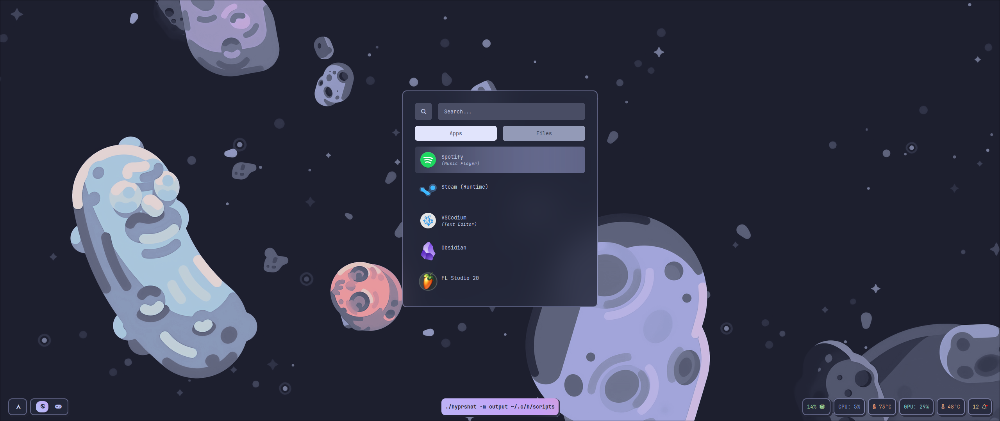
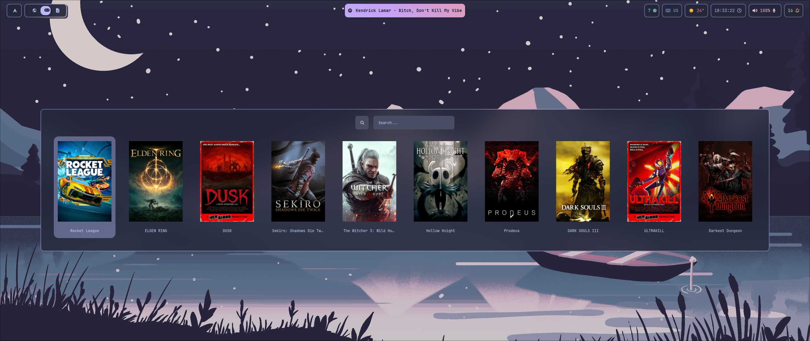
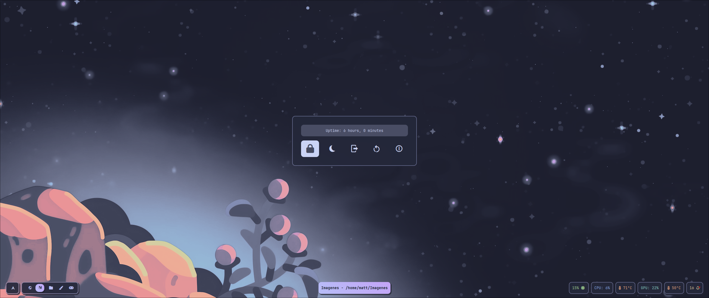
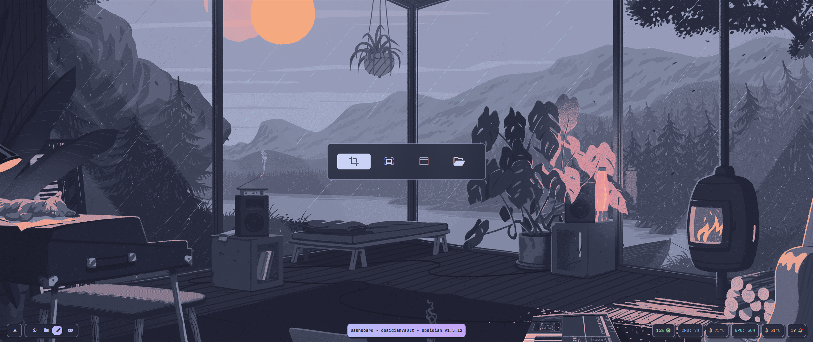
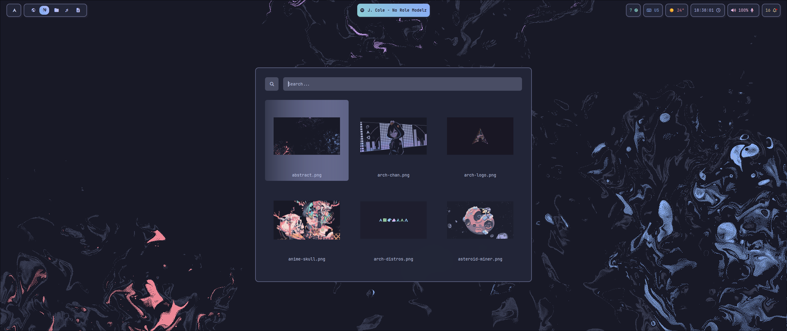

 

# :camera: ‎ <samp>Gallery</samp>

| **Applications**                           |
| ------------------------------------------ |
|  |

| **Game Launcher**                            |
| -------------------------------------------- |
|  |

| **Powermenu**                        |
| ------------------------------------ |
|  |

| **Screenshots**                          |
| ---------------------------------------- |
|  |

| **Wallpapers**                         |
| -------------------------------------- |
|  |
