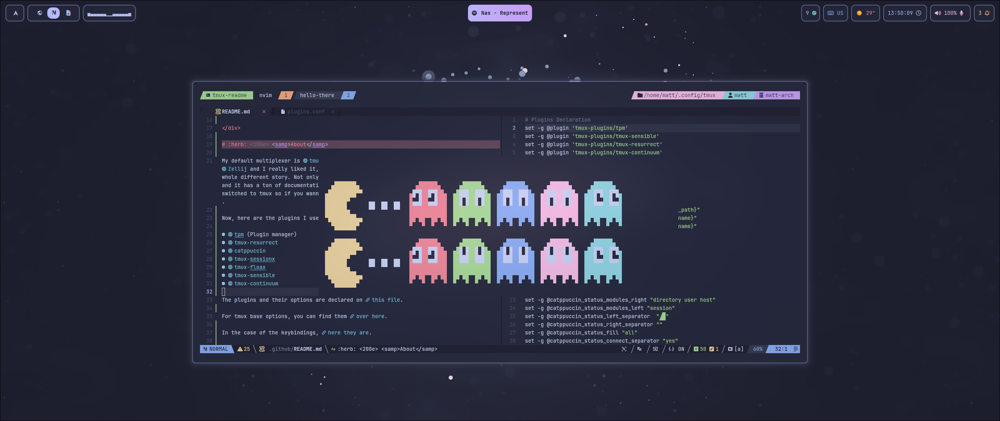
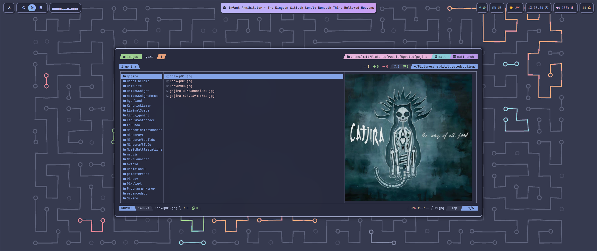
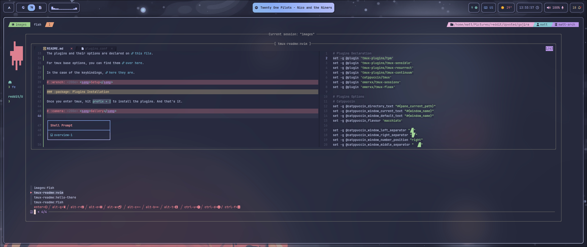

 

# :herb: ‎ <samp>About</samp>

My default multiplexer is [tmux](https://github.com/tmux/tmux). In the past I tried [Zellij](https://zellij.dev/) and I really liked it, but when I tried tmux, it was a whole different story. Not only is faster, but more customizable, has a ton of plugins and it has a ton of documentation and help online. I had a zellij config before I switched to tmux so if you wanna see it, [take a look](https://github.com/Matt-FTW/dotfiles/commit/8e63e29833470bebd0d812035ec811149d0c5d7e).

Now, here are the plugins I use alongside tmux:

- [tpm](https://github.com/tmux-plugins/tpm) (Plugin manager)
- [catppuccin](https://github.com/catppuccin/tmux)
- [tmux-sessionx](https://github.com/omerxx/tmux-sessionx)
- [tmux-fzf-url](https://github.com/wfxr/tmux-fzf-url)
- [tmux-sensible](https://github.com/tmux-plugins/tmux-sensible)

The plugins and their options are declared on [this file](../conf/plugins.conf).

For tmux base options, you can find them [over here](../conf/options.conf).

In the case of the keybindings, [here they are](../conf/binds.conf).

# :wrench: ‎ <samp>Setup</samp>

### :package: Plugins Installation

Once you enter tmux, hit `prefix + I` to install all the plugins. And that's it.

# :camera: ‎ <samp>Gallery</samp>

| **Floating Terminal**           |
| ------------------------------- |
|  |

| **Image Preview**               |
| ------------------------------- |
|  |

| **Session Manager**             |
| ------------------------------- |
|  |
