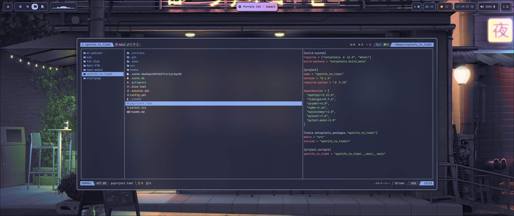
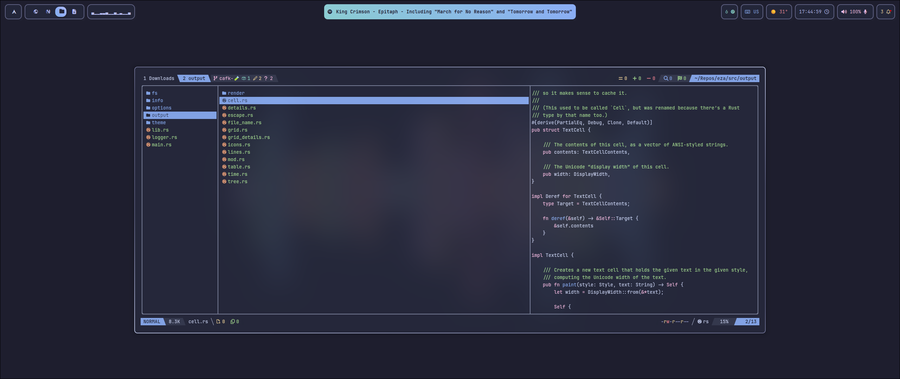
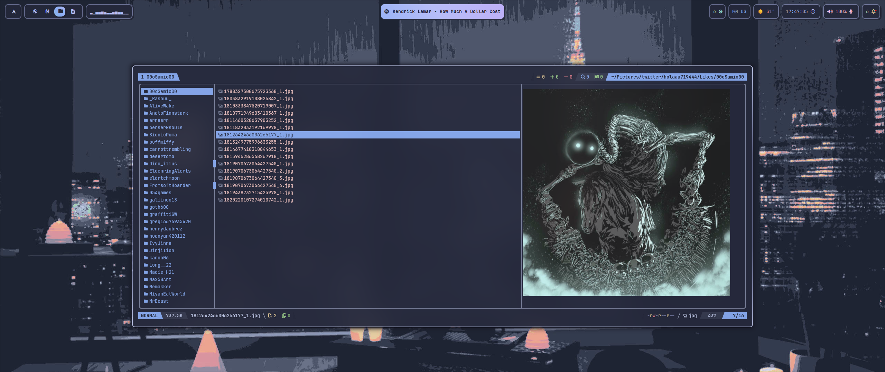

<div align="center">
<a href="#"></a>
</div>

<div align="center">

<br>

</div>

<div align="center">

<a href="#herb--about"></a>
<a href="#wrench--setup"></a>
<a href="#camera--gallery"></a>

</div>

# :herb: ‎ <samp>About</samp>

[Yazi](https://github.com/sxyazi/yazi) is my preferred file manager for the terminal. There's options like [xplr](https://github.com/sayanarijit/xplr), [lf](https://github.com/gokcehan/lf) or [ranger](https://github.com/ranger/ranger), but I feel like yazi is a next-gen file manager, written in Rust, with a plugin ecosystem written in Lua.
Its fast, easy to use and so customizable.

The plugins I'm using are the following:

- [full-border](https://github.com/yazi-rs/plugins/tree/main/full-border.yazi)
- [searchjump](https://gitee.com/DreamMaoMao/searchjump.yazi)
- [yatline](https://github.com/imsi32/yatline.yazi)
- [yatline-githead](https://github.com/imsi32/yatline-githead.yazi)
- [fg](https://gitee.com/DreamMaoMao/fg.yazi)
- [smart-filter](https://github.com/yazi-rs/plugins/tree/main/smart-filter.yazi)
- [hide-preview](https://github.com/yazi-rs/plugins/tree/main/hide-preview.yazi)
- [git](https://github.com/yazi-rs/plugins/tree/main/git.yazi)

The added keymaps are located on [this file](../keymap.toml).

If you wanna check the theme or add another one, you can do so in the [flavors folder](../flavors/). After that make sure to edit [theme.toml](../theme.toml) and add that new flavor name.

Any other configurations are inside the [yazi.toml file](../yazi.toml), like if you wanna add other programs when opening certain type of files or modify the fetchers.

Be sure to read [the docs](https://yazi-rs.github.io/) if you wanna know all the options available.

# :wrench: ‎ <samp>Setup</samp>

### :package: Plugins Installation

Yazi has a plugin manager built in, called `ya`. To manage yazi plugins you can use the next commands:

```bash
# Add a plugin
ya pack -a <plugin-name>

# Install plugins
ya pack -i

# To update all extensions
ya pack -u
```

> [!NOTE]
> Check the docs for every extensions to find the exact commands and the next steps to take, like initializing the plugins in the [init.lua](../init.lua) file

There are some packages that cannot be managed with `ya`. You can clone them with git like this:

```bash
git clone <repo-link> ~/.config/yazi/plugins/<plugin-name>
```

> [!WARNING]
> If you dont install all the plugins I have, make sure to remove their init calls (basically, the require(<plugin-name>) call) on [this file](../init.lua) or yazi will not launch.

# :camera: ‎ <samp>Gallery</samp>

| **Repo**                        |
| ------------------------------- |
|  |

| **Rust Code inside a Repo**     |
| ------------------------------- |
|  |

| **Image Preview**               |
| ------------------------------- |
|  |
