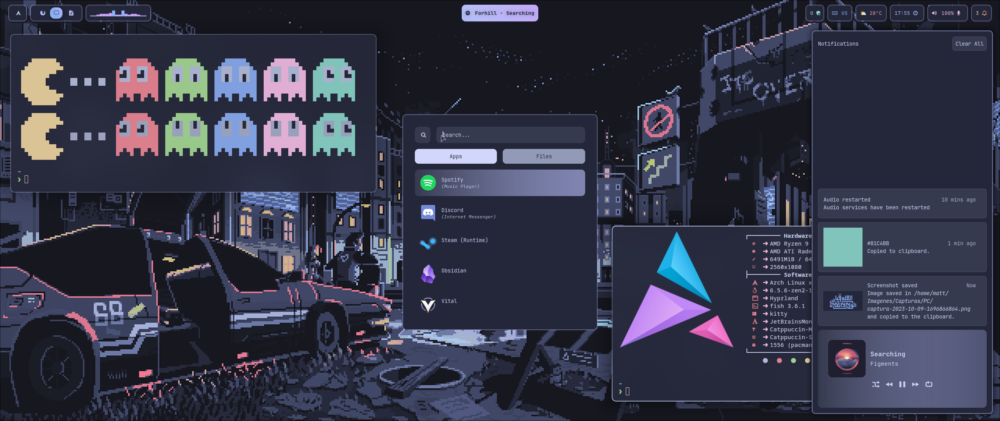
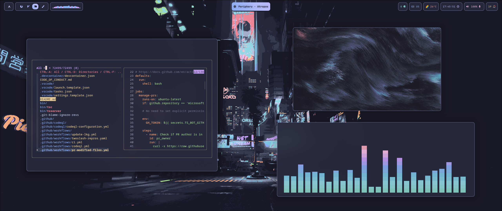

## :herb: ‎ <samp>About</samp>

Hey there! :wave:

This is my personal repository for my Dotfiles.

I've been working on this for a long time so I hope you like it!

This repo is always changing, so I may add new stuff in the future. If you encounter some issues or if you have any ideas to improve the setup, make sure to report them in the issue tracker over here at Github.

---

Here is some _small_ information about my setup:

> :information_source: INFO: Some of this apps have the config included in the repo (marked with :gear:), others don't because simply they don't have any or is not worth saving it because use of their defaults. Also, my favorite programs and tools are marked with :sparkles:

  
<b>🐧 System</b>

- **OS**: [Arch Linux](https://archlinux.org/) :sparkles: ([btw](https://www.reddit.com/r/archlinux/comments/6hv94x/has_anyone_seen_arch/))
- **Package Manager**: [Pacman](https://wiki.archlinux.org/title/Pacman) ([Config](../.config/pacman/)) :gear:
- **AUR Helper**: [yay](https://github.com/Jguer/yay) :sparkles: ([Config](../.config/yay/)) :gear:
- **Window Manager**: [Hyprland](https://hyprland.org/) :sparkles: ([Config](../.config/hypr/)) :gear:
- **Panel**: [Waybar](https://github.com/Alexays/Waybar) :sparkles: ([Config](../.config/waybar/)) :gear:
- **Terminal Emulator**: [Kitty](https://sw.kovidgoyal.net/kitty/) :sparkles: ([Config](../.config/kitty/)) :gear:
- **Notification Daemon/Center**: [swaync](https://github.com/ErikReider/SwayNotificationCenter) ([Config](../.config/swaync/)) :gear:
- **Application Launcher**: [Rofi](https://github.com/lbonn/rofi) :sparkles: ([Config](../.config/rofi/)) :gear:
- **Audio Daemon**: [Pipewire](https://pipewire.org/) ([Config](../.config/pipewire/)) :gear:
- **Firewall**: [ufw](https://wiki.archlinux.org/title/ufw)
- **Clipboard Manager**: [wl-clipboard](https://github.com/bugaevc/wl-clipboard) (with [cliphist](https://github.com/sentriz/cliphist))
- **Wallpaper Switcher**: [swww](https://github.com/Horus645/swww)
- **Lock Screen**: [swaylock-effects](https://github.com/mortie/swaylock-effects) ([Config](../.config/swaylock/)) :gear:
- **Idle Timeout**: [swayidle](https://github.com/swaywm/swayidle) ([Config](../.config/swayidle/)) :gear:
- **Color Picker**: [Hyprpicker](https://github.com/hyprwm/hyprpicker)
- **Recording Tool**: [wf-recorder](https://github.com/ammen99/wf-recorder)
- **Screenshot Tool**: [Hyprshot](https://github.com/Gustash/Hyprshot)
- **Logout Menu**: [wleave](https://github.com/AMNatty/wleave) ([Config](../.config/wleave/)) :gear:

  
<b>🖥️ CLI/TUI Apps</b>

- **Shell**: [Fish](https://fishshell.com/) :sparkles: ([Config](../.config/fish/)) :gear:
- **Shell Prompt**: [Starship](https://starship.rs/) ([Config](../.config/starship/)) :gear:
- **Shell History**: [Atuin](https://github.com/atuinsh/atuin) ([Config](../.config/atuin/)) :gear:
- **CD Replacement**: [zoxide](https://github.com/ajeetdsouza/zoxide) :sparkles:
- **LS Replacement**: [eza](https://github.com/eza-community/eza)
- **Cat Replacement**: [bat](https://github.com/sharkdp/bat) ([Config](../.config/bat/)) :gear:
- **Help Pages**: [Navi](https://github.com/denisidoro/navi) / [TLDR](https://tldr.sh/) ([Config](../.config/navi/)) :gear:
- **Fuzzy File Finder**: [fzf](https://github.com/junegunn/fzf) :sparkles:
- **Fuzzy Word Finder**: [Ripgrep](https://github.com/BurntSushi/ripgrep) ([Config](../.config/rg/)) :gear:
- **Editor**: [Neovim](https://neovim.io/) :sparkles: ([Config](../.config/nvim/)) :gear:
- **File Manager**: [Yazi](https://yazi-rs.github.io/) :sparkles: ([Config](../.config/yazi/)) :gear:
- **Git UI**: [Lazygit](https://github.com/jesseduffield/lazygit) :sparkles: ([Config](../.config/lazygit/)) :gear:
- **Npm Manager UI**: [Lazynpm](https://github.com/jesseduffield/lazynpm)
- **Docker UI**: [Lazydocker](https://github.com/jesseduffield/lazydocker)
- **Arch Package Search UI**: [Pacseek](https://github.com/moson-mo/pacseek) ([Config](../.config/pacseek/)) :gear:
- **Update Tool**: [Topgrade](https://github.com/topgrade-rs/topgrade) ([Config](../.config/topgrade/)) :gear:
- **Audio Visualizer**: [Cava](https://github.com/karlstav/cava) ([Config](../.config/cava/)) :gear:
- **System Monitor**: [btop](https://github.com/aristocratos/btop) ([Config](../.config/btop/)) :gear:
- **GPU Monitor**: [nvtop](https://github.com/Syllo/nvtop)
- **System Fetch**: [Neofetch](https://github.com/dylanaraps/neofetch) ([Config](../.config/neofetch/)) :gear:
- **Git Fetch**: [Onefetch](https://github.com/o2sh/onefetch)
- **Keybindings TUI**: [Keyb](https://github.com/kencx/keyb) :sparkles: ([Config](../.config/keyb/)) :gear:

  
<b>🖱️ GUI Apps</b>

- **Music Player**: [Spotify](https://open.spotify.com/) (patched with [Spicetify](https://spicetify.app/)) ([Config](../.config/spicetify/)) :gear:
- **Web Browser**: [Librewolf](https://librewolf.net/) / [Thorium](https://thorium.rocks/) :sparkles: ([Config](../.config/browser/)) :gear:
- **Messaging App**: [Discord](https://discord.com/) (patched with [BetterDiscord](https://betterdiscord.app/)) ([Config](../.config/BetterDiscord/)) :gear:
- **Email Client**: [Thunderbird](https://www.thunderbird.net/)
- **PDF Viewer**: [Zathura](https://pwmt.org/projects/zathura/) ([Config](../.config/zathura/)) :gear:
- **Note Taking**: [Obsidian](https://obsidian.md/) :sparkles:
- **Video Player**: [Celluloid](https://celluloid-player.github.io/) ([MPV](https://mpv.io/) frontend) ([Config](../.config/mpv/)) :gear:
- **Image Viewer**: [geeqie](https://www.geeqie.org/) ([Config](../.config/geeqie/)) :gear:
- **File Manager**: [Nemo](https://community.linuxmint.com/software/view/nemo)
- **Audio Effects**: [Easyeffects](https://github.com/wwmm/easyeffects)
- **Image Editor**: [Gimp](https://www.gimp.org/)
- **Paint Tool**: [Pinta](https://www.pinta-project.com/)
- **VM Manager**: [Virt-Manager](https://virt-manager.org/) ([QEMU](https://www.qemu.org/))
- **Recording Program**: [OBS](https://obsproject.com/)
- **Office Apps**: [LibreOffice](https://www.libreoffice.org/) ([Config](../.config/libreoffice/4/user/config/)) :gear:

  
<b>🔍 Other</b>

- **Colorscheme**: [Catppuccin Macchiato](https://github.com/catppuccin/catppuccin) :sparkles:
- **Font**: [Jetbrains Mono Nerd](https://www.jetbrains.com/es-es/lp/mono/)
- **Dotfiles Manager**: [yadm](https://yadm.io/) :sparkles: ([Config](../.config/yadm/)) :gear:
- **Automatic System Deployment**: [Ansible](https://www.ansible.com/)

## :wrench: ‎ <samp>Setup</samp>

#### :package: <samp>Automatic Installation (Arch Linux)</samp>

> :warning: WARNING: This installation is specifically designed for Arch Linux. If you're running other systems, install the packages with your OS's package manager.

##### WIP

#### :package: <samp>Manual Installation (Universal) </samp>

> :information_source: INFORMATION: This installation assumes you have the **.config dir** in your home dir. Also, note that the names of the packages are from the AUR and Arch Repos. Adapt them to your system.

##### WIP

## :camera: ‎ <samp>Gallery</samp>

> :information_source: For specific images and videos about each tool, check out their own READMEs at their respective config folders. (STILL WIP)

## :tada: ‎ <samp>Credits</samp>

Big thanks to everyone at r/unixporn for inspiring me to make this!

I wanna point out some resources that helped me the most with the setup:

- [ArchWiki](https://wiki.archlinux.org/) for all the awesome documentation.
- [Folke](https://github.com/folke) for his amazing contributions to the Neovim community with some awesome plugins and with the distro that i use: **LazyVim**. Also, his READMEs and [dotfiles](https://github.com/folke/dot) are amazing!
- [Yoru's README](https://github.com/rxyhn/yoru/tree/main) to help me with the distribution of the README
- [Amadeus Dots](https://github.com/AmadeusWM/dotfiles-hyprland) for helping me with the startup setup of the Hyprland WM.
- [Catppuccin](https://github.com/catppuccin/catppuccin) for making the **Best Colorscheme Ever** 🖌️

Those were the biggest inspiring factor for me, though you can find a lot more of setups that helped me in my List of Dotfiles from the **Stars** section of my Github Profile: [Check it out!](https://github.com/stars/Matt-FTW/lists/paintbrush-theming-dots)

## ⭐ Star History

Thanks to everyone who gave a star to this project! ❤️

<a href="https://star-history.com/#Matt-FTW/dotfiles&Timeline">
  <picture>
    <source media="(prefers-color-scheme: dark)" srcset="https://api.star-history.com/svg?repos=Matt-FTW/dotfiles&type=Timeline&theme=dark" />
    <source media="(prefers-color-scheme: light)" srcset="https://api.star-history.com/svg?repos=Matt-FTW/dotfiles&type=Timeline" />
    
  </picture>
</a>
