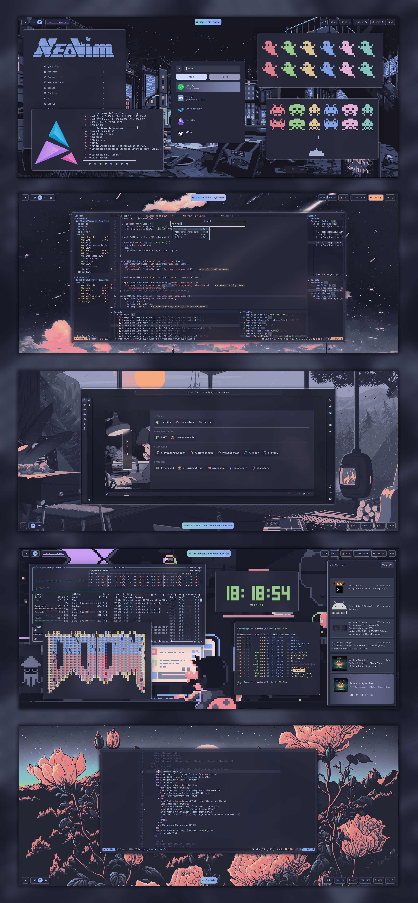
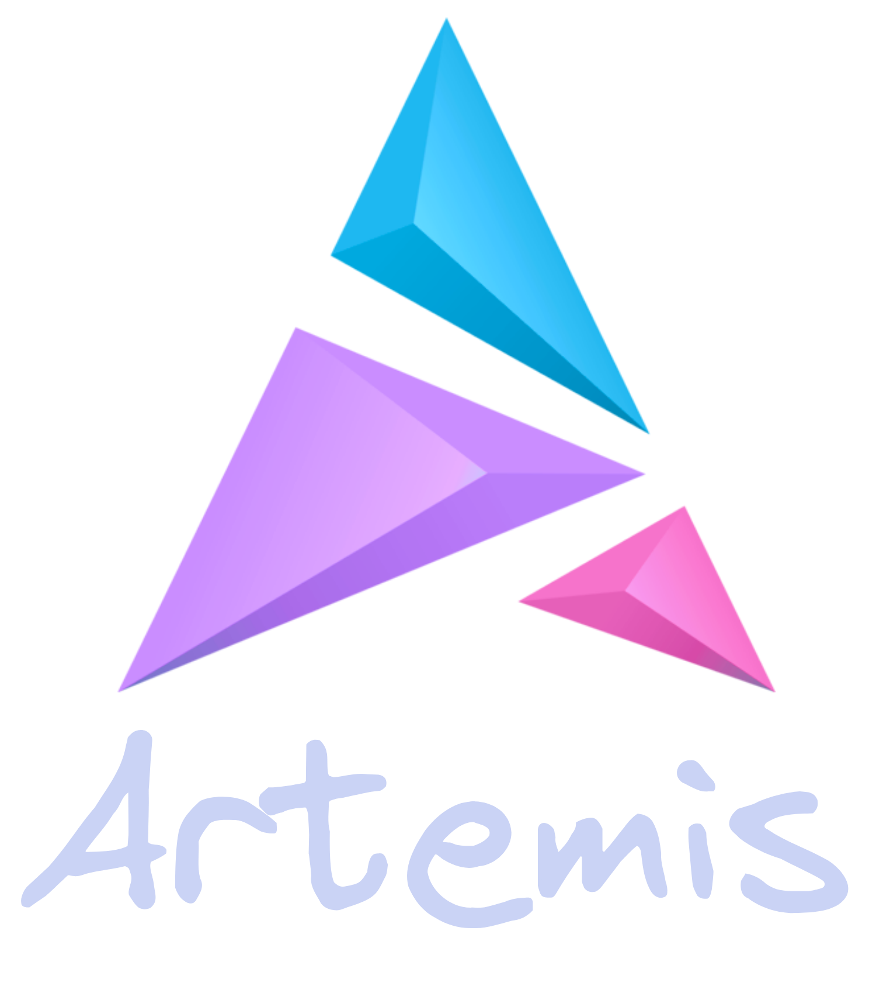
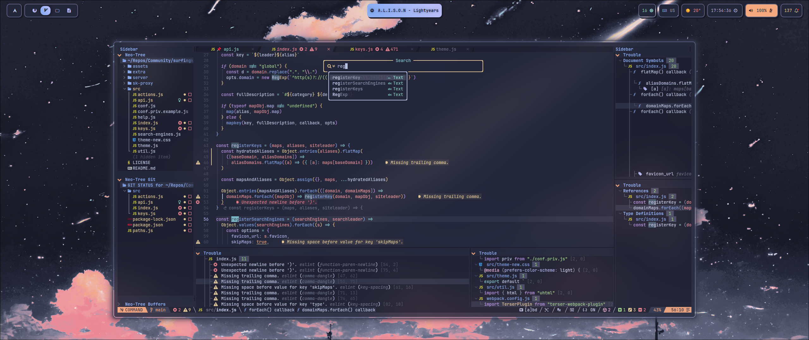
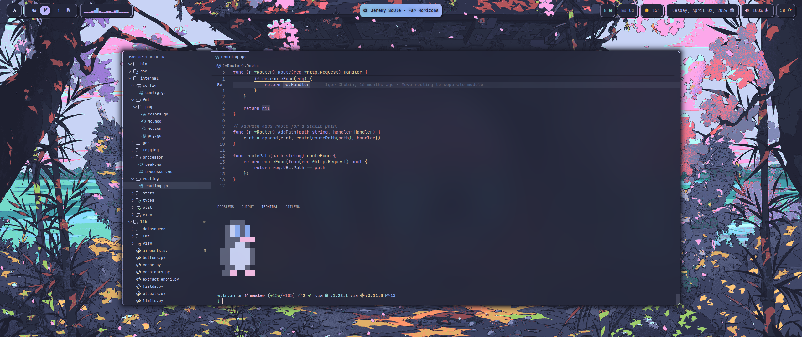
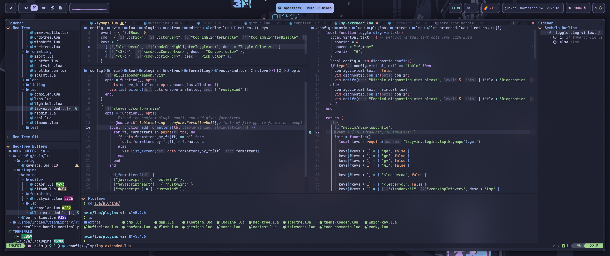
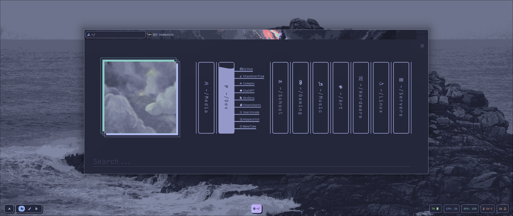
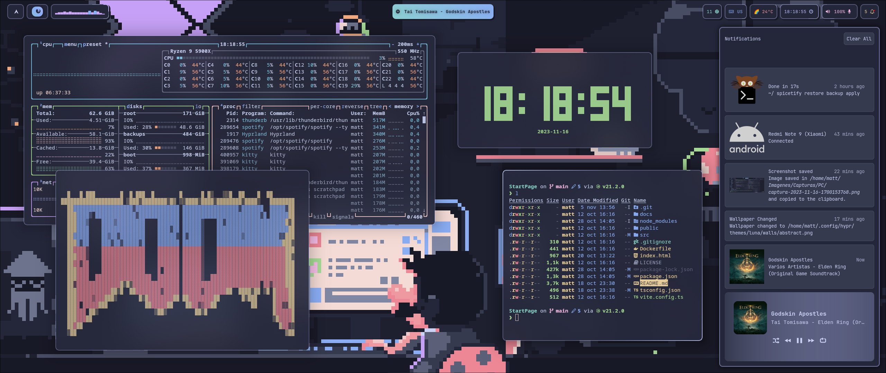
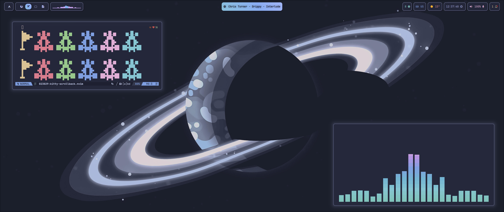
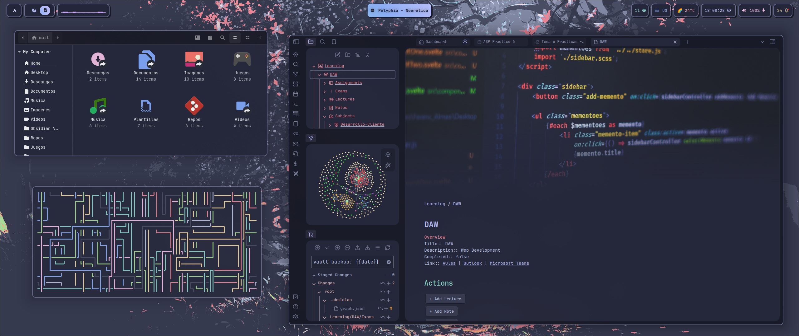

 

 

	
	
  
	

# :herb: ‎ <samp>About</samp>

Hey there! :wave:

This is my personal dotfiles repository.

I created this repo to help me backup my config files and to easily **deploy** them in a new machine with the help of [Ansible](https://www.ansible.com/) and [yadm](https://yadm.io). It has some files exclusive to my personal use (programming, gaming, etc) so it's not just a rice.

At first I didn't think about ricing but more and more, my focus has got into creating a good and aesthetic rice, with a lot of customization, as well as maintaining the easy deploy and use for my multiple machines.

If you wanna know how to **install** them, go to the [setup](#wrench--setup) section. It has a guided installation and an automatic one (Only for Arch Linux users)

I've been working on this for a long time so I hope you like it!

### ✨ Features

- :scroll: Scratchpads
- :bell: Notification Center
- :zzz: Neovim powered by LazyVim with custom extras added (More than 200!)
- :dark_sunglasses: Dark Mode for the whole system
- :framed_picture: Various Wallpapers
- :nerd_face: Nerd Fonts for the Shell Prompt
- :rocket: VSCodium with native integration of your Neovim setup
- :loud_sound: Volume OSD
- :iphone: App Launcher
- :keyboard: Multiple Keyboard Layouts
- :art: Color scripts for the terminal
- :car: Automatic mount of USB devices with notification
- :lock: Idle and lock apps
- :open_file_folder: Following XDG Base Directory Standard
- :broom: Organized and cleaned up config files
- :film_projector: Recording script
- :point_up: Screenshot, Clipboard, Color and Wallpaper Picker
- :boom: Performance Mode
- :window: Window Animations
- :desktop_computer: AwesomeWM workspace behavior
- :crab: Rust Alternatives
- :gear: Various other tweaks

---

### 🌸 Core System Info

 

The rice codename is **Artemis** 🏹, named after the Greek goddess of the hunt and the wild.

- **OS**: [Arch Linux](https://archlinux.org/) :boom:
- **WM**: [hyprland](https://hyprland.org/) :window:
- **Shell**: [fish](https://fishshell.com/) :shell:
- **Terminal Emulator**: [kitty](https://sw.kovidgoyal.net/kitty/) :cat:
- **Panel**: [waybar](https://github.com/Alexays/Waybar) :shaved_ice:
- **Text Editor**: [neovim](https://neovim.io/) :keyboard:
- **App Launcher**: [rofi](https://davatorium.github.io/rofi/) :rocket:
- **File Manager**: [yazi](https://yazi-rs.github.io/) / [nemo](https://community.linuxmint.com/software/view/nemo) :open_file_folder:
- **Browser**: [librewolf](https://librewolf.net/) :globe_with_meridians:
- **Notification Manager**: [swaync](https://github.com/ErikReider/SwayNotificationCenter) :bell:
- **Colorscheme**: [Catppuccin](https://github.com/catppuccin/catppuccin) :art:

---

### 🐧 Whole System Info

Here is all the information about my setup:

> [!NOTE]
> Some of this apps have the config files included in the repo, which are marked with ⚙️.
> Also, my favorite are programs and tools are marked with 💖.

  
<b>🐧 System</b>

| 📚 Entry                       | ✨ App                                                                                                         |
| ------------------------------ | -------------------------------------------------------------------------------------------------------------- |
| **OS**                         | 💖 [Arch Linux](https://archlinux.org/)                                                                        |
| **Package Manager**            | [Pacman](https://wiki.archlinux.org/title/Pacman) [:gear:](../.config/pacman/)                                 |
| **AUR Helper**                 | 💖 [yay](https://github.com/Jguer/yay) [:gear:](../.config/yay/)                                               |
| **Window Manager**             | 💖 [Hyprland](https://hyprland.org/) [:gear:](../.config/hypr/)                                                |
| **Notification Daemon/Center** | [swaync](https://github.com/ErikReider/SwayNotificationCenter) [:gear:](../.config/swaync/)                    |
| **OSD Popup**                  | [swayosd](https://github.com/ErikReider/SwayOSD)                                                               |
| **Bar**                        | 💖 [Waybar](https://github.com/Alexays/Waybar) [:gear:](../.config/waybar/)                                    |
| **Audio Daemon**               | [Pipewire](https://pipewire.org/) [:gear:](../.config/pipewire/)                                               |
| **Application Launcher**       | 💖 [Rofi](https://github.com/lbonn/rofi) [:gear:](../.config/rofi/)                                            |
| **Firewall**                   | [ufw](https://wiki.archlinux.org/title/ufw)                                                                    |
| **Clipboard Manager**          | [wl-clipboard](https://github.com/bugaevc/wl-clipboard) (with [cliphist](https://github.com/sentriz/cliphist)) |
| **Wallpaper Switcher**         | [swww](https://github.com/Horus645/swww)                                                                       |
| **Lock Screen**                | [swaylock-effects](https://github.com/jirutka/swaylock-effects) [:gear:](../.config/swaylock/)                 |
| **Idle Timeout**               | [swayidle](https://github.com/swaywm/swayidle) [:gear:](../.config/swayidle/)                                  |
| **Color Picker**               | [Hyprpicker](https://github.com/hyprwm/hyprpicker)                                                             |
| **Recording Tool**             | [wf-recorder](https://github.com/ammen99/wf-recorder)                                                          |
| **Screenshot Tool**            | [Hyprshot](https://github.com/Gustash/Hyprshot)                                                                |
| **Screenshot Editor**          | [Swappy](https://github.com/jtheoof/swappy)                                                                    |
| **Logout Menu**                | [wleave](https://github.com/AMNatty/wleave) [:gear:](../.config/wleave/)                                       |

  
<b>🖥️ CLI/TUI Apps</b>

| 📚 Entry                    | ✨ App                                                                                           |
| --------------------------- | ------------------------------------------------------------------------------------------------ |
| **Shell**                   | 💖 [Fish](https://fishshell.com/) [:gear:](../.config/fish/)                                     |
| **Terminal Emulator**       | 💖 [Kitty](https://sw.kovidgoyal.net/kitty/) [:gear:](../.config/kitty/)                         |
| **Shell Prompt**            | [Starship](https://starship.rs/) [:gear:](../.config/starship/)                                  |
| **Text Editor**             | 💖 [Neovim](https://neovim.io/) [:gear:](../.config/nvim/)                                       |
| **Shell History**           | [Atuin](https://github.com/atuinsh/atuin) [:gear:](../.config/atuin/)                            |
| **CD Replacement**          | 💖 [zoxide](https://github.com/ajeetdsouza/zoxide)                                               |
| **LS Replacement**          | [eza](https://github.com/eza-community/eza)                                                      |
| **Cat Replacement**         | [bat](https://github.com/sharkdp/bat) [:gear:](../.config/bat/)                                  |
| **Find Replacement**        | [fd](https://github.com/sharkdp/fd) [:gear:](../.config/fd/)                                     |
| **File Manager**            | 💖 [Yazi](https://yazi-rs.github.io/) [:gear:](../.config/yazi/)                                 |
| **Help Pages**              | [Navi](https://github.com/denisidoro/navi) / [TLDR](https://tldr.sh/) [:gear:](../.config/navi/) |
| **Fuzzy File Finder**       | 💖 [fzf](https://github.com/junegunn/fzf)                                                        |
| **Fuzzy Word Finder**       | [Ripgrep](https://github.com/BurntSushi/ripgrep) [:gear:](../.config/rg/)                        |
| **Git TUI**                 | 💖 [Lazygit](https://github.com/jesseduffield/lazygit) [:gear:](../.config/lazygit/)             |
| **Npm Manager TUI**         | [Lazynpm](https://github.com/jesseduffield/lazynpm)                                              |
| **Docker TUI**              | [Lazydocker](https://github.com/jesseduffield/lazydocker)                                        |
| **Arch Package Search TUI** | [Pacseek](https://github.com/moson-mo/pacseek) [:gear:](../.config/pacseek/)                     |
| **Trash CLI**               | [Gtrash](https://github.com/umlx5h/gtrash)                                                       |
| **Update Tool**             | [Topgrade](https://github.com/topgrade-rs/topgrade) [:gear:](../.config/topgrade/)               |
| **Audio Visualizer**        | [Cava](https://github.com/karlstav/cava) [:gear:](../.config/cava/)                              |
| **System Monitor**          | [btop](https://github.com/aristocratos/btop) [:gear:](../.config/btop/)                          |
| **GPU Monitor**             | [nvtop](https://github.com/Syllo/nvtop)                                                          |
| **System Fetch**            | [Neofetch](https://github.com/dylanaraps/neofetch) [:gear:](../.config/neofetch/)                |
| **Git Fetch**               | [Onefetch](https://github.com/o2sh/onefetch)                                                     |
| **Keybindings TUI**         | [Keyb](https://github.com/kencx/keyb) [:gear:](../.config/keyb/)                                 |

  
<b>🖱️ GUI Apps</b>

| 📚 Entry                 | ✨ App                                                                                                                                                                                                                                  |
| ------------------------ | --------------------------------------------------------------------------------------------------------------------------------------------------------------------------------------------------------------------------------------- |
| **Music Player**         | [Spotify](https://open.spotify.com/) (patched with [Spicetify](https://spicetify.app/)) [:gear:](../.config/spicetify/)                                                                                                                 |
| **Fallback Text Editor** | [VSCodium](https://vscodium.com/) [:gear:](../.config/VSCodium/User/)                                                                                                                                                                   |
| **Web Browser**          | 💖 [Librewolf](https://librewolf.net/) [:gear:](../.config/browser/)                                                                                                                                                                    |
| **Messaging App**        | [Discord](https://discord.com/) (patched with [BetterDiscord](https://betterdiscord.app/)) [:gear:](../.config/BetterDiscord/)   [Vesktop](https://github.com/Vencord/Vesktop) (custom Discord Client) [:gear:](../.config/vesktop/) |
| **Email Client**         | [Thunderbird](https://www.thunderbird.net/)                                                                                                                                                                                             |
| **PDF Viewer**           | [Zathura](https://pwmt.org/projects/zathura/) [:gear:](../.config/zathura/)                                                                                                                                                             |
| **Note Taking App**      | 💖 [Obsidian](https://obsidian.md/) [:gear:](../.config/obsidian/)                                                                                                                                                                      |
| **Video Player**         | [Celluloid](https://celluloid-player.github.io/) ([MPV](https://mpv.io/) frontend) [:gear:](../.config/mpv/)                                                                                                                            |
| **Image Viewer**         | [geeqie](https://www.geeqie.org/) [:gear:](../.config/geeqie/)                                                                                                                                                                          |
| **File Manager**         | [Nemo](https://community.linuxmint.com/software/view/nemo)                                                                                                                                                                              |
| **Audio Effects**        | [Easyeffects](https://github.com/wwmm/easyeffects)                                                                                                                                                                                      |
| **Image Editor**         | [Krita](https://krita.org/)                                                                                                                                                                                                             |
| **VM Manager**           | [Virt-Manager](https://virt-manager.org/) ([QEMU](https://www.qemu.org/))                                                                                                                                                               |
| **Recording Program**    | [OBS](https://obsproject.com/)                                                                                                                                                                                                          |
| **Office Apps**          | [LibreOffice](https://www.libreoffice.org/)                                                                                                                                                                                             |

  
<b>🔍 Other</b>

| 📚 Entry                        | ✨ App                                                               |
| ------------------------------- | -------------------------------------------------------------------- |
| **Colorscheme**                 | 💖 [Catppuccin Macchiato](https://github.com/catppuccin/catppuccin)  |
| **Font**                        | [JetBrainsMono Nerd Font](https://www.jetbrains.com/es-es/lp/mono/)  |
| **Icon Theme**                  | [Catppuccin-SE](https://github.com/ljmill/catppuccin-icons)          |
| **Dotfiles Manager**            | 💖 [yadm](https://yadm.io/) [:gear:](../.config/yadm/)               |
| **Automatic System Deployment** | 💖 [Ansible](https://www.ansible.com/) [:gear:](../.config/ansible/) |

# :wrench: ‎ <samp>Setup</samp>

### :package: <samp>Automatic Installation (Arch Linux)</samp>

> [!WARNING]
> This installation is specifically designed for Arch Linux. If you're running other systems, install the packages with your OS's package manager.

#### WIP

### :package: <samp>Manual Installation (Universal) </samp>

> [!WARNING]
> This installation assumes you have the **.config dir** in your home dir. Also, note that the names of the packages are from the AUR and Arch Repos. Adapt them to your system.

#### WIP

# :camera: ‎ <samp>Gallery</samp>

> [!NOTE]
> For specific images and videos about each tool, check out their own READMEs at their respective config folders. (STILL WIP 🚧)

| **System Fetch, Pacman Colorscript, App Launcher and Notif. Center** |
| -------------------------------------------------------------------- |
|                |

| **Audio Visualizer, Fuzzy Finder in a Git Directory and Image Viewer** |
| ---------------------------------------------------------------------- |
|                  |

| **TUI File Manager, ls replacement and System Fetch**  |
| ------------------------------------------------------ |
|  |

| **Text Editor and Git UI Manager**                     |
| ------------------------------------------------------ |
|  |

| **Text Editor**                                        |
| ------------------------------------------------------ |
|  |

| **Browser with Main Page**                             |
| ------------------------------------------------------ |
|  |

| **System Fetch, Matrix Script and Browser on [r/unixporn](https://www.reddit.com/r/unixporn/)** |
| ----------------------------------------------------------------------------------------------- |
|                                           |

| **TUI System Monitor, Doom and Clock Script, ls replacement and Notif. Center** |
| ------------------------------------------------------------------------------- |
|                           |

| **Text Editor**                                        |
| ------------------------------------------------------ |
|  |

| **File Manager, pipes script and Note Taking App**       |
| -------------------------------------------------------- |
|  |

# :tada: ‎ <samp>Credits</samp>

Big thanks to everyone at r/unixporn for inspiring me to make this!

I wanna point out some resources that helped me the most with the setup:

- [ArchWiki](https://wiki.archlinux.org/) for all the awesome documentation and for helping me to not lose my mind.
- [Folke](https://github.com/folke) for his amazing contributions to the Neovim community with some awesome plugins and with the distro that i use: **LazyVim**. Also, his READMEs and [dotfiles](https://github.com/folke/dot) are amazing!
- [Yoru's README](https://github.com/rxyhn/yoru/tree/main) to help me with the distribution of the README.
- [Amadeus Dots](https://github.com/AmadeusWM/dotfiles-hyprland) for helping me with the startup setup of the Hyprland WM.
- [Hyprdots](https://github.com/prasanthrangan/hyprdots) for helping me to take ideas from their work. Also, their setup is the best one I've ever seen for Hyprland; it's pretty awesome!.
- [Catppuccin](https://github.com/catppuccin/catppuccin) for making the **Best Colorscheme Ever** 🖌️
- [Github-issue-templates](https://github.com/stevemao/github-issue-templates) for the some of the markdown templates of the repo.

Those were the biggest inspiring factor for me, though you can find a lot more of setups that helped me in my list of favorite dotfiles from the **Stars** section of my Github Profile: [Check it out!](https://github.com/stars/Matt-FTW/lists/paintbrush-theming-dots)

### :writing_hand: Contributing

Part of what makes the open source community special are the contributions. Any contributions will be **highly appreciated!**

If you have any ideas or suggestions to make, feel free to [open an issue](https://github.com/Matt-FTW/dotfiles/issues/new/choose) or [submit a PR](https://github.com/Matt-FTW/dotfiles/pulls)

Please, before submitting a PR or opening an issue, be sure to follow the [contributing guidelines](./CONTRIBUTING.md), as well as the [issues](./ISSUE_TEMPLATE/) and [pull requests](./PULL_REQUEST_TEMPLATE.md) formatting rules.

Blank or repeated issues and PRs will be closed.

### :dollar: Donating

If you want to support my work, please consider donating.

This is optional, but it's always appreciated.

Thank you! :sparkling_heart:

### :two_hearts: Star History and Contributors

Thanks to everyone who have contributed and given an star to this project!

#### :pencil2: Contributors

#### :star: Star History

  <a href="https://star-history.com/#Matt-FTW/dotfiles&Timeline">
    <picture>
      <source media="(prefers-color-scheme: dark)" srcset="https://api.star-history.com/svg?repos=Matt-FTW/dotfiles&type=Timeline&theme=dark" />
      <source media="(prefers-color-scheme: light)" srcset="https://api.star-history.com/svg?repos=Matt-FTW/dotfiles&type=Timeline" />
      
    </picture>
  </a>

 

  

