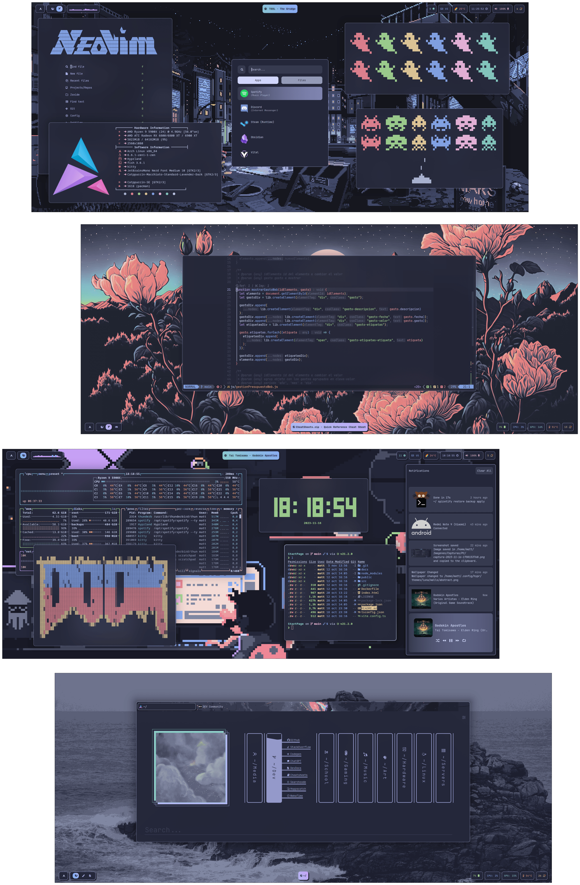
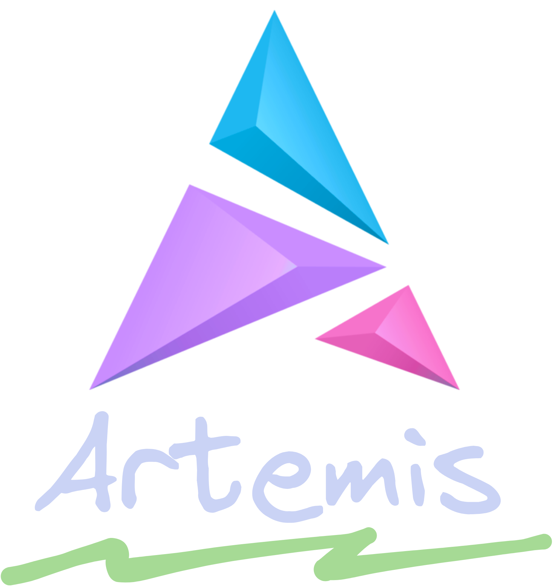
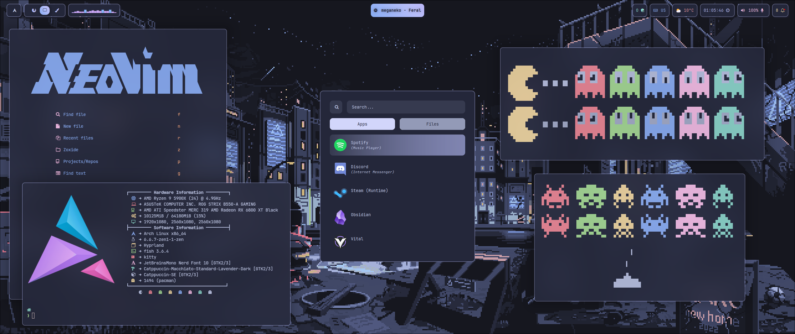
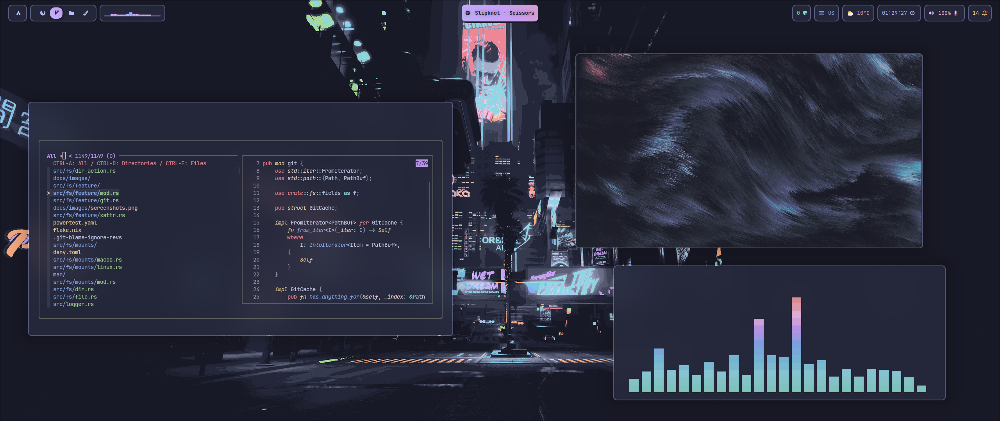
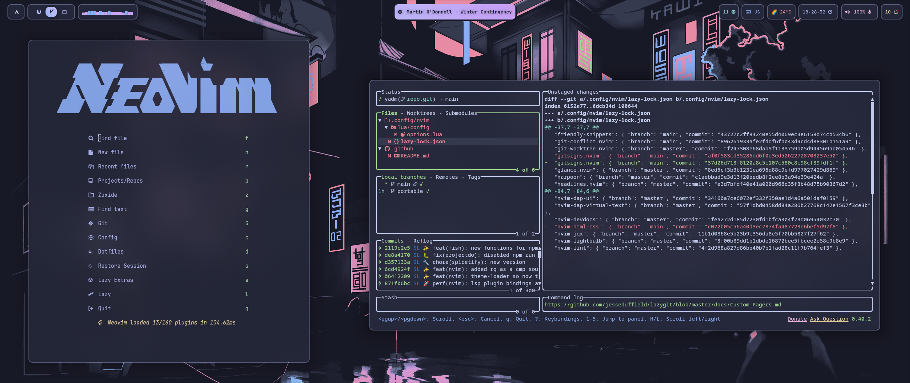
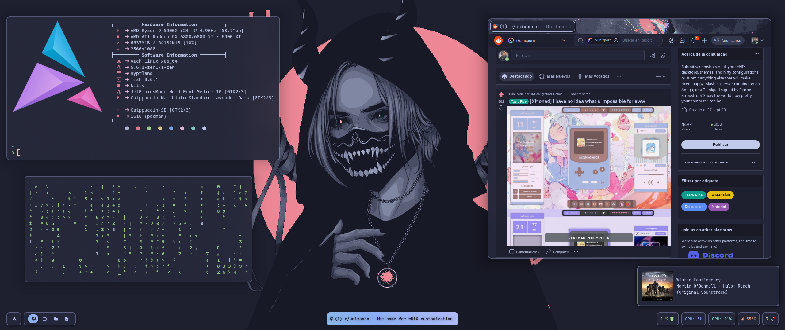
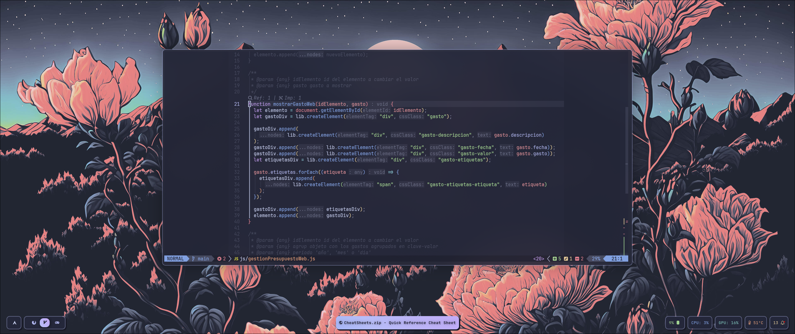

<div align="center">
<a href="#"></a>
</div>

<div align="center">

<br>

</div>

<div align="center">

<a href="#herb--about"></a>
<a href="#wrench--setup"></a>
<a href="#camera--gallery"></a>
<a href="#tada--credits"></a>

</div>

<div align="center">



</div>

<br>

<div align="center">
 <a href="https://github.com/Matt-FTW/dotfiles/stargazers"></a>
 <a href="https://github.com/Matt-FTW/dotfiles/issues"></a>
  <a href="https://github.com/Matt-FTW/dotfiles/commits/main/"></a>
 <a href="https://github.com/Matt-FTW/dotfiles"></a>
</div>

# :herb: ‎ <samp>About</samp>

Hey there! :wave:

This is my personal dotfiles repository.

I created this repo to help me backup my config files and to easily **deploy** them in a new machine with the help of [Ansible](https://www.ansible.com/) and [yadm](https://yadm.io). It has some files exclusive to my personal use (programming, gaming, etc) so it's not just a rice.

At first I didn't think about ricing but more and more, my focus has got into creating a good and aesthetic rice, with a lot of customization, as well as maintaining the easy deploy and use for my multiple machines.

If you wanna know how to **install** them, go to the [setup](#wrench--setup) section. There is a guided installation.

I've been working on this for a long time so I hope you like it!

### ✨ Features

- :dark_sunglasses: Dark Mode for the Whole System
- :zzz: Neovim powered by LazyVim with Custom Extras Added (More than 200!)
- :point_up: Screenshot, Keybindings, Games, Clipboard, Color and Wallpaper Picker
- :window: Animations for nearly all the System
- :desktop_computer: AwesomeWM Workspace Behavior
- :open_file_folder: Following XDG Base Directory Standard
- :car: Automatic Mounting of USB Devices with Notification
- :scroll: Scratchpads
- :dizzy: Beautiful [Wallpapers](../.config/hypr/theme/walls/.github/README.md)
- :nerd_face: Shell Prompt with Nerd Icons
- :heavy_plus_sign: Extra Hyprland Plugins
- :earth_americas: Custom Userchrome and Extension Configurations
- :rocket: Minimal VSCodium with Native Integration of your Neovim Setup
- :crab: Rust Alternatives
- :bell: Notification Center
- :loud_sound: Volume and Brightness OSD
- :art: Color Scripts for the Terminal
- :lock: Idle and Lock apps
- :zap: Performance Mode
- :gear: Various other Tweaks

---

### 🌸 Core System Info

 

The rice codename is **Artemis** 🏹, named after the Greek goddess of the hunt and the wild.

- **OS**: [Arch Linux](https://archlinux.org/) :boom:
- **WM**: [hyprland](https://hyprland.org/) :window:
- **Shell**: [fish](https://fishshell.com/) :shell:
- **Terminal Emulator**: [kitty](https://sw.kovidgoyal.net/kitty/) :cat:
- **Panel**: [waybar](https://github.com/Alexays/Waybar) :shaved_ice:
- **Text Editor**: [neovim](https://neovim.io/) :keyboard:
- **App Launcher**: [rofi](https://davatorium.github.io/rofi/) :rocket:
- **File Manager**: [yazi](https://yazi-rs.github.io/) / [nemo](https://community.linuxmint.com/software/view/nemo) :open_file_folder:
- **Browser**: [Floorp](https://floorp.app/en) :globe_with_meridians:
- **Notification Manager**: [swaync](https://github.com/ErikReider/SwayNotificationCenter) :bell:
- **Colorscheme**: [Catppuccin](https://github.com/catppuccin/catppuccin) :art:

---

### 🐧 Whole System Info

Here is all the information about my setup:

> [!NOTE]
> Some of this apps have the config files included in the repo, which are marked with ⚙️.
> Also, my favorite are programs and tools are marked with 💖.

<details>
  <summary><b>🐧 System</b></summary>

| 📚 Entry                       | ✨ App                                                                                                                                       |
| ------------------------------ | -------------------------------------------------------------------------------------------------------------------------------------------- |
| **OS**                         | 💖 [Arch Linux](https://archlinux.org/)                                                                                                      |
| **Package Manager**            | [pacman](https://wiki.archlinux.org/title/Pacman) [:gear:](../.config/pacman/)                                                               |
| **AUR Helper**                 | 💖 [yay](https://github.com/Jguer/yay) [:gear:](../.config/yay/)                                                                             |
| **Window Manager**             | 💖 [hyprland](https://hyprland.org/) [:gear:](../.config/hypr/)                                                                              |
| **Notification Daemon/Center** | [swaync](https://github.com/ErikReider/SwayNotificationCenter) [:gear:](../.config/swaync/)                                                  |
| **OSD Popup**                  | [swayosd](https://github.com/ErikReider/SwayOSD)                                                                                             |
| **Bar**                        | 💖 [waybar](https://github.com/Alexays/Waybar) [:gear:](../.config/waybar/)                                                                  |
| **Audio Daemon**               | [pipewire](https://pipewire.org/)                                                                                                            |
| **Application Launcher**       | 💖 [rofi](https://github.com/lbonn/rofi) [:gear:](../.config/rofi/)                                                                          |
| **Firewall**                   | [ufw](https://wiki.archlinux.org/title/ufw)                                                                                                  |
| **Clipboard Manager**          | [wl-clipboard](https://github.com/bugaevc/wl-clipboard) (with [cliphist](https://github.com/sentriz/cliphist))                               |
| **Wallpaper Switcher**         | [swww](https://github.com/Horus645/swww)                                                                                                     |
| **Lock Screen**                | [hyprlock](https://github.com/hyprwm/hyprlock) [:gear:](../.config/hypr/hyprlock.conf)                                                       |
| **Idle Timeout**               | [hypridle](https://github.com/hyprwm/hypridle) [:gear:](../.config/hypr/hypridle.conf)                                                       |
| **Color Picker**               | [hyprpicker](https://github.com/hyprwm/hyprpicker)                                                                                           |
| **Screenshot Tool**            | [hyprshot](https://github.com/Gustash/Hyprshot) (Using [grim](https://sr.ht/~emersion/grim/) and [slurp](https://github.com/emersion/slurp)) |
| **Image Annotation**           | [satty](https://github.com/gabm/Satty) [:gear:](../.config/satty/)                                                                           |

</details>

<details>
  <summary><b>🖥️ CLI/TUI Apps</b></summary>

| 📚 Entry                    | ✨ App                                                                                           |
| --------------------------- | ------------------------------------------------------------------------------------------------ |
| **Shell**                   | 💖 [fish](https://fishshell.com/) [:gear:](../.config/fish/)                                     |
| **Terminal Emulator**       | 💖 [kitty](https://sw.kovidgoyal.net/kitty/) [:gear:](../.config/kitty/)                         |
| **Terminal Multiplexer**    | [tmux](https://github.com/tmux/tmux) [:gear:](../.config/tmux/)                                  |
| **Shell Prompt**            | [starship](https://starship.rs/) [:gear:](../.config/starship/)                                  |
| **Text Editor**             | 💖 [neovim](https://neovim.io/) [:gear:](../.config/nvim/)                                       |
| **Shell History**           | [atuin](https://github.com/atuinsh/atuin) [:gear:](../.config/atuin/)                            |
| **CD Replacement**          | 💖 [zoxide](https://github.com/ajeetdsouza/zoxide)                                               |
| **LS Replacement**          | [eza](https://github.com/eza-community/eza)                                                      |
| **Cat Replacement**         | [bat](https://github.com/sharkdp/bat) [:gear:](../.config/bat/)                                  |
| **Find Replacement**        | [fd](https://github.com/sharkdp/fd) [:gear:](../.config/fd/)                                     |
| **File Manager**            | 💖 [yazi](https://yazi-rs.github.io/) [:gear:](../.config/yazi/)                                 |
| **Help Pages**              | [navi](https://github.com/denisidoro/navi) / [TLDR](https://tldr.sh/) [:gear:](../.config/navi/) |
| **Fuzzy File Finder**       | 💖 [fzf](https://github.com/junegunn/fzf)                                                        |
| **Fuzzy Word Finder**       | [ripgrep](https://github.com/BurntSushi/ripgrep) [:gear:](../.config/rg/)                        |
| **Git TUI**                 | 💖 [lazygit](https://github.com/jesseduffield/lazygit) [:gear:](../.config/lazygit/)             |
| **Npm Manager TUI**         | [lazynpm](https://github.com/jesseduffield/lazynpm)                                              |
| **Docker TUI**              | [lazydocker](https://github.com/jesseduffield/lazydocker)                                        |
| **Arch Package Search TUI** | [pacseek](https://github.com/moson-mo/pacseek) [:gear:](../.config/pacseek/)                     |
| **Trash CLI**               | [gtrash](https://github.com/umlx5h/gtrash)                                                       |
| **Update Tool**             | [topgrade](https://github.com/topgrade-rs/topgrade) [:gear:](../.config/topgrade/)               |
| **Audio Visualizer**        | [cava](https://github.com/karlstav/cava) [:gear:](../.config/cava/)                              |
| **System Monitor**          | [btop](https://github.com/aristocratos/btop) [:gear:](../.config/btop/)                          |
| **GPU Monitor**             | [nvtop](https://github.com/Syllo/nvtop)                                                          |
| **System Fetch**            | [fastfetch](https://github.com/fastfetch-cli/fastfetch) [:gear:](../.config/fastfetch/)          |
| **Git Fetch**               | [onefetch](https://github.com/o2sh/onefetch)                                                     |
| **Keybindings TUI**         | [keyb](https://github.com/kencx/keyb) [:gear:](../.config/keyb/)                                 |

</details>

<details>
  <summary><b>🖱️ GUI Apps</b></summary>

| 📚 Entry                 | ✨ App                                                                                                                  |
| ------------------------ | ----------------------------------------------------------------------------------------------------------------------- |
| **Music Player**         | [Spotify](https://open.spotify.com/) (patched with [Spicetify](https://spicetify.app/)) [:gear:](../.config/spicetify/) |
| **Fallback Text Editor** | [VSCodium](https://vscodium.com/) [:gear:](../.config/VSCodium/User/)                                                   |
| **Web Browser**          | 💖 [Floorp](https://floorp.app/en/) [:gear:](../.config/browser/)                                                       |
| **Messaging App**        | [Vesktop](https://github.com/Vencord/Vesktop) (Custom Discord Client) [:gear:](../.config/vesktop/)                     |
| **Email Client**         | [Thunderbird](https://www.thunderbird.net/)                                                                             |
| **PDF Viewer**           | [Zathura](https://pwmt.org/projects/zathura/) [:gear:](../.config/zathura/)                                             |
| **Note Taking App**      | 💖 [Obsidian](https://obsidian.md/) [:gear:](../.config/obsidian/)                                                      |
| **Video Player**         | [MPV](https://mpv.io/) [:gear:](../.config/mpv/)                                                                        |
| **Image Viewer**         | [qimgv](https://github.com/easymodo/qimgv) [:gear:](../.config/qimgv//)                                                 |
| **File Manager**         | [Nemo](https://community.linuxmint.com/software/view/nemo)                                                              |
| **Audio Effects**        | [Easyeffects](https://github.com/wwmm/easyeffects)                                                                      |
| **Image Editor**         | [Krita](https://krita.org/)                                                                                             |
| **VM Manager**           | [Virt-Manager](https://virt-manager.org/) ([QEMU](https://www.qemu.org/))                                               |
| **Recording Program**    | [OBS](https://obsproject.com/)                                                                                          |
| **Office Apps**          | [LibreOffice](https://www.libreoffice.org/)                                                                             |

</details>

<details>
  <summary><b>🔍 Other</b></summary>

| 📚 Entry                        | ✨ App                                                               |
| ------------------------------- | -------------------------------------------------------------------- |
| **Colorscheme**                 | 💖 [Catppuccin Macchiato](https://github.com/catppuccin/catppuccin)  |
| **Font**                        | [JetBrainsMono Nerd Font](https://www.jetbrains.com/es-es/lp/mono/)  |
| **Icon Theme**                  | [Catppuccin-SE](https://github.com/ljmill/catppuccin-icons)          |
| **Dotfiles Manager**            | 💖 [yadm](https://yadm.io/) [:gear:](../.config/yadm/)               |
| **Automatic System Deployment** | 💖 [Ansible](https://www.ansible.com/) [:gear:](../.config/ansible/) |

</details>

# :wrench: ‎ <samp>Setup</samp>

> [!WARNING]
> The installation guide is under construction, try it at your own risk!

### :package: Dependencies Installation

> [!NOTE]
> The names of the packages are from the AUR and Arch Repos; adapt them to your system. Most of the packages are available on other distros official repos (most of the time out-to-date). To install CLI/TUI specific packages in non-arch based distros, I recommend to use [homebrew](https://brew.sh/).

- **Base Packages**

First, lets start with the required base packages for the configuration to function. Assuming you're running Arch Linux, and your AUR helper is [yay](https://github.com/Jguer/yay):

```bash
yay -Sy hyprland hyprlock hypridle xdg-desktop-portal-hyprland hyprpicker \
        swww waybar rofi-wayland swaync swayosd-git wl-clipboard wl-clip-persist \
        pyprland qt5ct pavucontrol cliphist playerctl udiskie devify fzf jq eza fd \
        catppuccin-gtk-theme-macchiato catppuccin-cursors-macchiato cava slurp grim satty vivid
```

On the first line we have the hypr ecosystem packages and on the other lines we have the must have packages.

- **Optional Packages**

Now lets move to the Optional Packages (If you don't want to install any more packages, move to the Dotfiles Installation step)

```bash
yay -Sy yazi nemo kitty ttf-ms-win11-auto ttf-jetbrainsmono-nerd zathura zathura-pdf-mupdf qimgv-light \
        ttf-nerd-fonts-symbols ttf-nerd-fonts-symbols-mono mpv
```

Here we have some packages that you can replace with your favorite ones and are not required at all for the desktop to function (though it wont look the same). For example, the terminal (kitty), the file manager (nemo and yazi), the font (ttf-jetbrainsmono-nerd), the video player (mpv), etc.

Useful CLI/TUI packages

```bash
yay -Sy ripgrep riprep-all sd duf nvtop btop dua-cli bat pacseek tgpt-bin sysz gtrash-bin topgrade fastfetch
```

Useful GUI packages

```bash
yay -Sy pika-backup vesktop-bin nwg-displays nwg-look gnome-logs galculator gparted nm-connection-editor
```

- **Bluetooth**

Lets start installing the Bluetooth packages:

```bash
yay -Sy bluez bluez-utils blueman
```

After installing the required packages, we have to start the Bluetooth service. With systemd is pretty straightforward:

```bash
systemctl --user enable bluetooth.service
systemctl --user start bluetooth.service
```

- **Icon Theme**

First off, we have to download the icon package from the releases page of their repo. You can do it very easily by using curl.

```bash
curl -LJO https://github.com/ljmill/catppuccin-icons/releases/download/v0.2.0/Catppuccin-SE.tar.bz2
```

Once you have that, its time to extract the compressed package.

```bash
tar -xf Catppuccin-SE.tar.bz2
```

And finally, move them to the ~/.local/share/icons directory.

```bash
mv Catppuccin-SE ~/.local/share/icons/
```

---

### :floppy_disk: Dotfiles Installation

> [!WARNING]
> Here we can take two routes. **CHOOSE ONE, NOT BOTH!**

### <samp>Yadm Method (_Easier to install and maintain, recommended_)</samp>

[Yadm](https://yadm.io/) is amazing. It lets you manage your dotfiles with git without the hassle of creating a git repo on your home directory as well as gitignoring a lot of files.

It also lets you pull from the repos that you set up on remote to your local repo and then push to your personal remote.

I'd recommend you to look at it if you want a more personal and advanced config.

For now, we are going to install it the simple way without to many complications and just to have an origin to pull and another to push.

Firstly, **be sure to backup your existing config files**. Then, we are going to install yadm. You can do it using pacman with the following command:

```bash
sudo pacman -S yadm
```

After that, its time to clone the dotfiles repo into your system using yadm.

> [!NOTE]
> If you any file of the repo that already exists in your system and the content differs, the local file will be left unmodified and you'll have to review the changes and resolve the differences.

```bash
yadm clone https://github.com/Matt-FTW/dotfiles.git
```

If you installed the fonts mentioned earlier, be sure to refresh the font cache.

```bash
fc-cache -fv
```

Congratulations, at this point your done installing the configuration! :tada:

Logout from your current desktop session and log back into the Hyprland session.

If you want to pull from my remote, commit or add any files you can do it using yadm and then the git command you want to use (pull, commit, add, etc).

Now, if you want to **add your personal remote**, use the following command:

```bash
yadm remote add origin <url>
```

Then, be sure to push your changes to your remote!

Now you can receive new updates from my repo and modify your custom one :sunglasses:

If you had any issues or you have some questions about the installation process, feel free to [open an issue](https://github.com/Matt-FTW/dotfiles/issues/new/choose) or a [new discussion post](https://github.com/Matt-FTW/dotfiles/discussions/new/choose)

### <samp>Git Method (_Classic method, not recommended_)</samp>

Firstly, clone this repository (remember to have git installed).

```bash
git clone https://github.com/Matt-FTW/dotfiles.git
cd dotfiles
```

Now is time to copy the files into their respective directories. **Be sure to backup your existing configuration files** before copying the files.
Once you have that, its time to copy the config files.

```bash
cp -r .config/* ~/.config/
cp -r .local/bin/* ~/.local/bin/
```

If you installed the fonts mentioned earlier, be sure to refresh the font cache.

```bash
fc-cache -fv
```

Congratulations, at this point your done installing the configuration! :tada:

Logout from your current desktop session and log back into the Hyprland session.

If you had any issues or you have some questions about the installation process, feel free to [open an issue](https://github.com/Matt-FTW/dotfiles/issues/new/choose) or a [new discussion post](https://github.com/Matt-FTW/dotfiles/discussions/new/choose)

# :camera: ‎ <samp>Gallery</samp>

> [!NOTE]
> For specific images and videos about each tool, check out their own READMEs at their respective config folders. (STILL WIP 🚧)

> [!NOTE]
> If you want to check the wallpapers, they are available [right here](../.config/hypr/theme/walls/.github/README.md).

| **System Fetch, Pacman Colorscript, App Launcher and Notif. Center** |
| -------------------------------------------------------------------- |
|                |

| **Text Editor**                                        |
| ------------------------------------------------------ |
|  |

| **TUI File Manager, ls replacement and System Fetch**  |
| ------------------------------------------------------ |
|  |

| **GUI Text Editor**                                    |
| ------------------------------------------------------ |
|  |

| **System Fetch, Matrix Script and Browser on [r/unixporn](https://www.reddit.com/r/unixporn/)** |
| ----------------------------------------------------------------------------------------------- |
|                                           |

| **Browser with Main Page**                             |
| ------------------------------------------------------ |
|  |

| **Lockscreen**                                         |
| ------------------------------------------------------ |
|  |

| **TUI System Monitor, Doom and Clock Script, ls replacement and Notif. Center** |
| ------------------------------------------------------------------------------- |
|                           |

| **Text Editor and Audio Visualizer**                   |
| ------------------------------------------------------ |
|  |

| **File Manager, pipes script and Note Taking App**       |
| -------------------------------------------------------- |
|  |

| **Text Editor and Git UI Manager**                       |
| -------------------------------------------------------- |
|  |

| **Audio Visualizer, Fuzzy Finder in a Git Directory and Image Viewer** |
| ---------------------------------------------------------------------- |
|                |

| **Text Editor**                                          |
| -------------------------------------------------------- |
|  |

| **Game Platform and Music Player**                       |
| -------------------------------------------------------- |
|  |

| **Text Editor**                                          |
| -------------------------------------------------------- |
|  |

| **Old Browser with Main Page**                           |
| -------------------------------------------------------- |
|  |

# :tada: ‎ <samp>Credits</samp>

Big thanks to everyone at r/unixporn for inspiring me to make this!

I wanna point out some resources that helped me the most with the setup:

- [ArchWiki](https://wiki.archlinux.org/) for all the awesome documentation and for helping me to not lose my mind.
- [Folke](https://github.com/folke) for his amazing contributions to the Neovim community with some awesome plugins and with the distro that i use: **LazyVim**. Also, his READMEs and [dotfiles](https://github.com/folke/dot) are amazing!
- [Yoru's README](https://github.com/rxyhn/yoru/tree/main) to help me with the distribution of the README.
- [Amadeus Dots](https://github.com/AmadeusWM/dotfiles-hyprland) for helping me with the startup setup of the Hyprland WM.
- [Hyprdots](https://github.com/prasanthrangan/hyprdots) for helping me to take ideas from their work. Also, their setup is the best one I've ever seen for Hyprland; it's pretty awesome!.
- [Catppuccin](https://github.com/catppuccin/catppuccin) for making the **Best Colorscheme Ever** 🖌️
- [Github-issue-templates](https://github.com/stevemao/github-issue-templates) for the some of the markdown templates of the repo.
- [Shina-Fox](https://github.com/Shina-SG/Shina-Fox) for the incredible userChrome.
- [Catppuccin-Startpage](https://github.com/pivoshenko/catppuccin-startpage) an asthetic and clean startpage for the browser.

Those were the biggest inspiring factor for me, though you can find a lot more of setups that helped me in my list of favorite dotfiles from the **Stars** section of my Github Profile: [Check it out!](https://github.com/stars/Matt-FTW/lists/paintbrush-theming-dots)

### :writing_hand: Contributing

Part of what makes the open source community special are the contributions. Any contributions will be **highly appreciated!**

If you have any ideas or suggestions to make, feel free to [open an issue](https://github.com/Matt-FTW/dotfiles/issues/new/choose) or [submit a PR](https://github.com/Matt-FTW/dotfiles/pulls)

Please, before submitting a PR or opening an issue, be sure to follow the [contributing guidelines](./CONTRIBUTING.md), as well as the [issues](./ISSUE_TEMPLATE/) and [pull requests](./PULL_REQUEST_TEMPLATE.md) formatting rules.

Blank or repeated issues and PRs will be closed.

### :dollar: Donating

If you want to support my work, please consider donating.

This is optional, but it's always appreciated.

Thank you! :sparkling_heart:

[](https://github.com/sponsors/Matt-FTW)
[](https://ko-fi.com/matt_ftw)
[](https://www.buymeacoffee.com/matt_ftw)

### :two_hearts: Star History and Contributors

Thanks to everyone who have contributed and given an star to this project!

<div align="center">

#### :pencil2: Contributors

</div>

<a href="https://github.com/Matt-FTW/dotfiles/graphs/contributors">
  
</a>

<div align="center">

#### :star: Star History

</div>

<div>
  <a href="https://star-history.com/#Matt-FTW/dotfiles&Timeline">
    <picture>
      <source media="(prefers-color-scheme: dark)" srcset="https://api.star-history.com/svg?repos=Matt-FTW/dotfiles&type=Timeline&theme=dark" />
      <source media="(prefers-color-scheme: light)" srcset="https://api.star-history.com/svg?repos=Matt-FTW/dotfiles&type=Timeline" />
      
    </picture>
  </a>
</div>

<br>

<div align="center">
  
</div>
